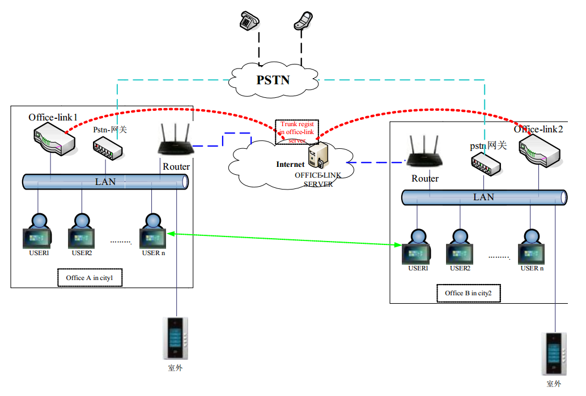
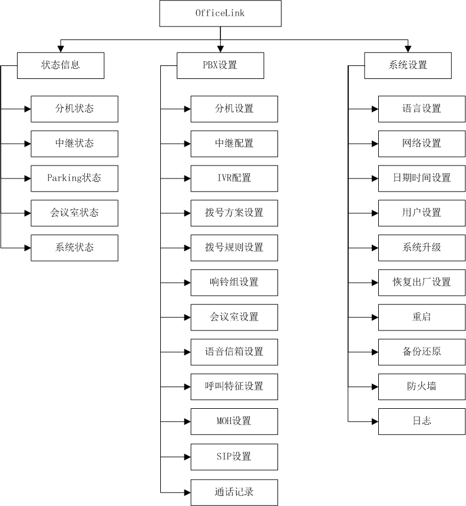
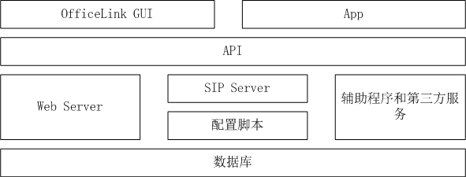
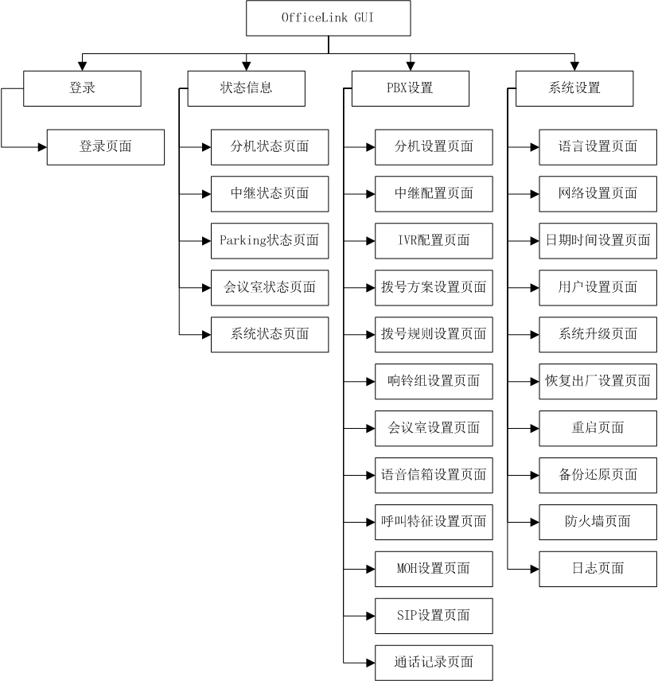
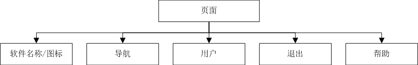

# OfficeLink

概要设计

版本号：V1.1

编制：

日期：2016.10.17

修订记录

| 版本 | 日期       | 作者   | 修改描述                                                          |
|------|------------|--------|-------------------------------------------------------------------|
| V1.1 | 2016.10.17 | 杨国正 | 初稿                                                              |
| V1.1 | 2016.11.15 | 杨国正 | API：异常返回，列表获取，加入权限 GUI：添加OfficeLink GUI相关设计 |
| V1.1 | 2016.11.17 | 杨国正 | API：公共部分提取，SIP设置部分修改 GUI：SIP设置部分修改           |
| V1.1 | 2016.11.25 | 杨国正 | 修改数据库字段错误和api示例错误                                   |
| V1.1 | 2016.11.30 | 杨国正 | 添加backups数据库                                                 |

## 1 引言

### 1.1 编写目的

供研发人员参考。

### 1.2 背景

- 系统名称: OfficeLink

- 相关人员:

| 序号 | 名称       | 人员   |
|------|------------|--------|
| 1    | 产品经理   | 程立兵 |
| 2    | 技术主管   | 田永浩 |
| 3    | 项目经理   | 杨国正 |
| 4    | 美工       | 丁湘楠 |
| 5    | 软件工程师 | 高欣   |
| 6    | 软件工程师 | 陈晨   |
| 7    | 硬件工程师 | 张艳玲 |
| 8    | 结构工程师 | 牛夕源 |
| 9    | 测试工程师 | 张新玲 |
| 10   | 测试工程师 | 崔娟   |

### 1.3 定义

| 序号 | 名称              | 描述                                                                                                                                                                                                                                                                                             |
|------|-------------------|--------------------------------------------------------------------------------------------------------------------------------------------------------------------------------------------------------------------------------------------------------------------------------------------------|
| 1    | VoIP              | Voice over Internet Protocol，就是将模拟信号（Voice）数字化，以数据封包（Data Packet）的形式在IP网络(IP Network）上做实时传递。                                                                                                                                                                  |
| 2    | SIP               | Session Initiation Protocol，会话初始协议，是由IETF（Internet Engineering Task Force，因特网工程任务组）制定的多媒体通信协议。                                                                                                                                                                   |
| 3    | PSTN              | Public Switched Telephone Network，公共交换电话网络，一种常用旧式电话系统。即我们日常生活中常用的电话网。                                                                                                                                                                                        |
| 4    | VoIP客户端        | 可以通过IP网络和另一端的VoIP客户端进行通信的软件。                                                                                                                                                                                                                                               |
| 5    | APP               | 拥有VoIP客户端功能的软件。                                                                                                                                                                                                                                                                       |
| 6    | SIP用户           | VoIP通话时使用的用户信息。                                                                                                                                                                                                                                                                       |
| 7    | 拨号方案          | 电话呼入呼出时拨号规则的集合。                                                                                                                                                                                                                                                                   |
| 8    | OfficeLink        | 可运行OfficeLink系统的硬件设备,或OfficeLink系统。                                                                                                                                                                                                                                                |
| 9    | OfficeLink-Server | 运行OfficeLink系统的公共网络中的服务器。                                                                                                                                                                                                                                                         |
| 10   | OfficeLink GUI    | OfficeLink系统提供的Web管理界面。                                                                                                                                                                                                                                                                |
| 11   | Caller ID         | Caller ID (caller identification ,CID)，也被叫做Calling line identification (CLID)或者 calling caller ID(CNID)，它是一种电话服务，在模拟电话、电子电话系统、和符合VoIP（Voice over Internet Protocol）等的应用中经常见到。                                                                       |
| 12   | Call Park         | Call Park 电话系统的一种功能特性，用于将一个通话保持在这台电话上保持起来，然后再另外的话机上继续通话。                                                                                                                                                                                           |
| 13   | H.264             | H.264，同时也是MPEG-4第十部分，是由ITU-T视频编码专家组（VCEG）和ISO/IEC动态图像专家组（MPEG）联合组成的联合视频组（JVT，Joint Video Team）提出的高度压缩数字视频编解码器标准。这个标准通常被称之为H.264/AVC（或者AVC/H.264或者H.264/MPEG-4 AVC或MPEG-4/H.264 AVC）而明确的说明它两方面的开发者。 |

### 1.4 参考资料

1. OFFICE-LINK应用功能说明.pdf

2. HomeLink架构设计.doc

3. OfficeLink设计输入v1.1.xlsx

## 2 总体设计

### 2.1 需求规定

### 2.2 应用场景



OfficeLink系统是一套可应用于办公环境的VoIP PBX系统。第一可以作为 IP 或混合的 PBX 的核心：交换呼叫、管理路由、使能特性，以及通过 IP、模拟线路（POTS）、以及数字（T1/E1）的联系同外部呼叫链接在一起；第二可作为呼叫中心：IVR（交互式语音呼叫中心流程应答系统）、ACD（自动呼叫分配系统）；第三可用于公共网络：互联网电话服务、语音信箱系统等。

### 2.3 功能概述



### 2.4 运行环境

Linux操作系统，支持嵌入式设备、台式机、虚拟机。

### 2.5 基本设计概念和处理流程

### 2.6 程序结构



## 3 数据库

说明：\*为必选项

### 3.1 分机号码信息

- 表名：sippeers

- 数据库：realtime.sqlite3 (/var/lib/asterisk/realtime.sqlite3)

- 信息：

| 字段名           | 数据类型 | 长度（字节） | 说明                                   |
|------------------|----------|--------------|----------------------------------------|
| extension \*     | char     | 20           | 分机号码                               |
| nickname         | char     | 20           | 昵称                                   |
| photo            | char     | 40           | 头像路经                               |
| dialplan \*      | char     | 20           | 拨号方案                               |
| password         | char     | 20           | 密码                                   |
| transfer\_days   | char     | 30           | 工作日                                 |
| transfer\_time   | char     | 20           | 转移时间段                             |
| transfer\_style  | char     | 10           | 转移方式                               |
| transfer\_type   | char     | 10           | 转移类型                               |
| transfer\_target | char     | 20           | 转移目标                               |
| ring\_timeout    | char     | 10           | 振铃时长（s）                          |
| codecs \*        | char     | 40           | 编码                                   |
| email            | char     | 20           | 邮箱                                   |
| voicemail\_pin   | char     | 10           | 语音信箱密码，此项为空时禁用语音信箱。 |

### 3.2 中继信息

- 表名：providers

- 数据库：realtime.sqlite3 (/var/lib/asterisk/realtime.sqlite3)

- 信息：

| 字段名      | 数据类型 | 长度（字节） | 说明               |
|-------------|----------|--------------|--------------------|
| name \*     | char     | 20           | 中继名称           |
| user        | char     | 20           | 用户名             |
| password    | char     | 20           | 密码               |
| address \*  | char     | 40           | 中继地址，IP或域名 |
| port        | char     | 5            | 端口               |
| dialplan \* | char     | 20           | 拨号方案           |
| entry \*    | char     | 20           | 入口               |

### 3.3 IVR信息

- 表名：ivrs

- 数据库：realtime.sqlite3 (/var/lib/asterisk/realtime.sqlite3)

- 信息：

| 字段名       | 数据类型 | 长度（字节） | 说明     |
|--------------|----------|--------------|----------|
| name \*      | char     | 20           | 名称     |
| extension \* | char     | 20           | 分机号码 |
| rules \*     | char     | 300          | 规则列表 |

### 3.4 拨号方案信息

- 表名：dialplans

- 数据库：realtime.sqlite3 (/var/lib/asterisk/realtime.sqlite3)

- 信息

| 字段名   | 数据类型 | 长度（字节） | 说明     |
|----------|----------|--------------|----------|
| name \*  | char     | 20           | 名称     |
| rules \* | char     | 300          | 规则列表 |

### 3.5 拨号规则信息

- 表名：dialrules

- 数据库：realtime.sqlite3 (/var/lib/asterisk/realtime.sqlite3)

- 信息

| 字段名   | 数据类型 | 长度（字节） | 说明     |
|----------|----------|--------------|----------|
| name \*  | char     | 20           | 名称     |
| rules \* | char     | 300          | 规则列表 |

### 3.6 响铃组信息

- 表名：ringgroups

- 数据库：realtime.sqlite3 (/var/lib/asterisk/realtime.sqlite3)

- 信息：

| 字段名         | 数据类型 | 长度（字节） | 说明     |
|----------------|----------|--------------|----------|
| name \*        | char     | 20           | 名称     |
| extension \*   | char     | 20           | 分机号码 |
| ring\_style \* | char     | 10           | 振铃方式 |
| timeout \*     | char     | 10           | 超时     |
| members \*     | char     | 300          | 成员列表 |

### 3.7 会议室信息

- 表名：meetme

- 数据库：realtime.sqlite3 (/var/lib/asterisk/realtime.sqlite3)

- 信息：

| 字段名            | 数据类型 | 长度（字节） | 说明       |
|-------------------|----------|--------------|------------|
| bookid            | Integer  | 4            |            |
| confno \*         | char     | 10           | 会议分机号 |
| starttime         | char     | 50           |            |
| pin \*            | char     | 10           | 成员密码   |
| adminpin \*       | char     | 10           | 管理员密码 |
| opts              | char     | 20           |            |
| adminopts         | char     | 20           |            |
| recordingfilename | char     | 40           |            |
| recordingformat   | char     | 40           |            |
| maxusers          | char     | 20           |            |
| members           | char     | 60           |            |

### 3.8 配置信息

- 表名：configs

- 数据库：realtime.sqlite3 (/var/lib/asterisk/realtime.sqlite3)

- 信息：

| 字段名    | 数据类型 | 长度（字节） | 说明     |
|-----------|----------|--------------|----------|
| config \* | char     | 20           | 配置类型 |
| items \*  | char     | 300          | 详细信息 |

### 3.9 MOH信息

- 表名：musiconhold

- 数据库：realtime.sqlite3 (/var/lib/asterisk/realtime.sqlite3)

- 信息：

| 字段名       | 数据类型 | 长度（字节） | 说明     |
|--------------|----------|--------------|----------|
| name \*      | char     | 20           | 名称     |
| mode \*      | char     | 10           | 类型     |
| directory \* | char     | 40           | 目录     |
| application  |          |              |          |
| digit        |          |              |          |
| sort         | char     | 10           | 排序规则 |
| format       |          |              |          |
| stamp        |          |              |          |

### 3.10 通话记录

- 表名：cdr (Call Detail Record)

- 数据库：master.db (/var/log/asterisk/master.db)

- 信息：

| 字段名         | 数据类型 | 长度（字节） | 说明     |
|----------------|----------|--------------|----------|
| AcctId         | Integer  | 4            |          |
| calldate \*    | char     | 10           | 拨入时间 |
| clid \*        | char     | 10           | 主叫号码 |
| cldid \*       | char     | 10           | 被叫号码 |
| dcontext       | char     | 10           |          |
| channel        | char     | 10           |          |
| dstchannel     | char     | 10           |          |
| lastapp        | char     | 10           |          |
| lastdata       | char     | 10           |          |
| duration \*    | char     | 10           | 通话时长 |
| billsec        | char     | 10           |          |
| disposition \* | char     | 10           | 接听动作 |
| amaflags       | char     | 10           |          |
| accountcode    | char     | 10           |          |
| uniqueid       | char     | 10           |          |
| userfield      | char     | 10           |          |
| test           | char     | 10           |          |

### 3.11 防火墙信息

- 表名：firewallfilters

- 数据库：realtime.sqlite3 (/var/lib/asterisk/realtime.sqlite3)

- 信息：

| 字段名    | 数据类型 | 长度（字节） | 说明     |
|-----------|----------|--------------|----------|
| name \*   | char     | 20           | 名称     |
| ip \*     | char     | 20           | 地址     |
| port \*   | char     | 5            | 端口号   |
| proto \*  | char     | 10           | 协议类型 |
| action \* | char     | 10           | 动作     |

### 3.12 用户

- 表名：users

- 数据库：realtime.sqlite3 (/var/lib/asterisk/realtime.sqlite3)

- 信息：

| 字段名      | 数据类型 | 长度（字节） | 说明               |
|-------------|----------|--------------|--------------------|
| name \*     | char     | 20           | 用户名             |
| password \* | char     | 20           | 密码               |
| permits \*  | char     | 40           | 权限列表：gui、api |

说明：用户权限类型分三种gui、api、sip，所有分机号信息表中的用户（用户名为分机号）拥有sip权限

### 3.13 备份列表

- 表名：backups

- 数据库：realtime.sqlite3 (/var/lib/asterisk/realtime.sqlite3)

- 信息：

| 字段名    | 数据类型 | 长度（字节） | 说明     |
|-----------|----------|--------------|----------|
| name \*   | char     | 20           | 名称     |
| remark \* | char     | 20           | 备注     |
| file \*   | char     | 60           | 文件名   |
| time \*   | char     | 40           | 备份时间 |

## 4 API设计

说明：\*为必选项, []中为可选参数, @name表示变量

### 4.1 API返回状态

- 数据：API.State

- 当访问带有权限的API时，需要用户登录且有相应的权限，否则将返回未登陆或未认证错误

| 字段名   | 数据类型 | 长度（字节） | 说明                                            |
|----------|----------|--------------|-------------------------------------------------|
| api \*   | String   | 40           | api url                                         |
| state \* | Integer  | 1            | 0: ok<br> 1: unknown error<br> 2: not logged in<br> 3: unauthorized<br> 4: data format error<br> 5: database error|
| msg      | String   | 100          | 失败时可输出错误信息                            |

- 示例：

```
{"api": "/api/user/login", "state": 0, "msg": "ok"}
```

### 4.2  用户登陆

#### 4.2.1  用户登陆

- URL：POST /api/user/login

- 参数：Object

| 字段名      | 数据类型 | 长度（字节） | 说明   |
|-------------|----------|--------------|--------|
| name \*     | String   | 40           | 用户名 |
| password \* | String   | 40           | 密码   |

- 示例：

```
{"name": "systec", "password": "123456"}
```

- 返回：API.State

#### 4.2.2 用户退出

- URL：POST /api/user/logout

- 参数：None

- 返回：API.State

### 4.3 分机状态

- URL：GET /api/extensions/status[/@page/@page\_size]

- 权限：gui, api, sip

- 说明：当权限为sip时，分机列表只有一条，即当前sip账户的信息

- 参数：无参数时将获取全部列表

| 字段名        | 数据类型 | 长度（字节） | 说明     |
|---------------|----------|--------------|----------|
| page \*       | Integer  | 1            | 当前页码 |
| page\_size \* | Integer  | 1            | 页大小   |

- 示例：

```
http://www.systec-pbx.net/api/extensions/status/2/20
```

- 返回：Object

| 字段名          | 数据类型     | 长度（字节） | 说明              |
|-----------------|--------------|--------------|-------------------|
| page \*         | Integer      | 1            | 当前页码          |
| total\_count \* | Integer      | 2            | 总条数            |
| extensions \*   | List\<Item\> | Item\*MAX    | 分机列表，MAX=200 |

- 分机列表：List\<Item\>

| 字段名         | 数据类型 | 长度（字节） | 说明                                       |
|----------------|----------|--------------|--------------------------------------------|
| extension \*   | String   | 20           | 分机号码                                   |
| nickname \*    | String   | 40           | 昵称                                       |
| photo          | String   | 40           | 头像路经                                   |
| state \*       | String   | 10           | 分机状态：free、ringing、busy、unavailable |
| unread\_msg \* | Integer  | 1            | 未读消息数量                               |
| read\_msg \*   | Integer  | 1            | 已读消息数量                               |

- 示例：

```
{"page": 2, "total_count": 30, "extensions": [{"extension": "6001", 
"nickname": "Spencer", "state": "free", "unread_msg": 1, "read_msg": 2}, …]}
```

### 4.4 中继状态

- URL：GET /api/providers/status[/@page/@page\_size]

- 权限：gui, api

- 参数：无参数时将获取全部列表

| 字段名        | 数据类型 | 长度（字节） | 说明     |
|---------------|----------|--------------|----------|
| page \*       | Integer  | 1            | 当前页码 |
| page\_size \* | Integer  | 1            | 页大小   |

- 示例：

```
http://www.systec-pbx.net/api/providers/status/1/20
```

- 返回：Object

| 字段名          | 数据类型     | 长度（字节） | 说明             |
|-----------------|--------------|--------------|------------------|
| page \*         | Integer      | 1            | 当前页码         |
| total\_count \* | Integer      | 2            | 总条数           |
| providers \*    | List\<Item\> | Item\*MAX    | 中继列表，MAX=30 |

- 中继列表：List\<Item\>

| 字段名     | 数据类型 | 长度（字节） | 说明                                    |
|------------|----------|--------------|-----------------------------------------|
| name \*    | String   | 20           | 中继名称                                |
| user       | String   | 40           | 用户名                                  |
| state \*   | String   | 10           | 中继状态：registered、unavailable、none |
| address \* | String   | 40           | 中继地址                                |
| port       | Integer  | 2            | 中继端口                                |

- 示例：

```
{"page": 1, "total_count": 30, "providers": [{"name": 
"officelink-server", "user": "80001", state: "registered", "address": 
"http://www.systec-pbx.net", "port": 5060}, …]}
```

### 4.5 Parking状态

- URL：GET /api/parkings/status[/@page/@page\_size]

- 权限：gui, api

- 参数：无参数时将获取全部列表

| 字段名        | 数据类型 | 长度（字节） | 说明     |
|---------------|----------|--------------|----------|
| page \*       | Integer  | 1            | 当前页码 |
| page\_size \* | Integer  | 1            | 页大小   |

- 示例：

```
http://www.systec-pbx.net/api/parkings/status/1/20
```

- 返回：Object

| 字段名          | 数据类型     | 长度（字节） | 说明        |
|-----------------|--------------|--------------|-------------|
| page \*         | Integer      | 1            | 当前页码    |
| total\_count \* | Integer      | 2            | 总条数      |
| parkings \*     | List\<Item\> | Item\*MAX    | Parking列表 |

- Parking列表：List\<Item\>

| 字段名       | 数据类型 | 长度（字节） | 说明      |
|--------------|----------|--------------|-----------|
| extension \* | String   | 20           | 分机号    |
| channel \*   | String   | 40           | 会话通道  |
| space \*     | String   | 20           | 停泊位置  |
| timeout \*   | Integer  | 1            | 超时（s） |

- 示例：

```
{"page": 1, "total_count": 15, "parkings": [{"extension": "6001", 
"channel": "SIP/6002-000001", space: "702", "timeout": "10s"}, …]}
```

### 4.6 会议室状态

- URL：GET /api/meetingrooms/status[/@page/@page\_size]

- 权限：gui, api

- 参数：无参数时将获取全部列表

| 字段名        | 数据类型 | 长度（字节） | 说明     |
|---------------|----------|--------------|----------|
| page \*       | Integer  | 1            | 当前页码 |
| page\_size \* | Integer  | 1            | 页大小   |

- 示例：

```
http://www.systec-pbx.net/api/meetingrooms/status/1/20
```

- 返回：Object

| 字段名          | 数据类型     | 长度（字节） | 说明       |
|-----------------|--------------|--------------|------------|
| page \*         | Integer      | 1            | 当前页码   |
| total\_count \* | Integer      | 2            | 总条数     |
| meetingrooms \* | List\<Item\> | Item\*MAX    | 会议室列表 |

- 会议室列表：List\<Item\>

| 字段名             | 数据类型     | 长度（字节） | 说明         |
|--------------------|--------------|--------------|--------------|
| room\_extension \* | String       | 20           | 会议室分机号 |
| count \*           | Integer      | 1            | 分机数量     |
| extensions         | List\<Item\> | Item\*20     | 分机列表     |

- 分机列表：List\<Item\>

| 字段名       | 数据类型 | 长度（字节） | 说明     |
|--------------|----------|--------------|----------|
| extension \* | String   | 20           | 分机号   |
| channel \*   | String   | 40           | 会话通道 |
| mute \*      | Boolean  | 1            | 静音状态 |

- 示例：

```
{"page": 1, "total_count": 30, "meetingrooms": [{"room\_extension": 
"6301", "count": 12, "extensions": [{"extension": "6001", "channel": 
"SIP/6001-000001"0, "mute": false}, …]}, …]}
```

### 4.7 系统状态

- URL：GET /api/system/info

- 权限：gui, api

- 返回：Object

| 字段名      | 数据类型        | 长度（字节） | 说明                            |
|-------------|-----------------|--------------|---------------------------------|
| load \*     | List\<Float\>   | Float\*3     | 系统负载：5分钟，十分钟，15分钟 |
| mem \*      | List\<Integer\> | Integer \*2  | 内存：已用，总量（K）           |
| disk \*     | List\<Integer\> | Integer\*2   | 硬盘：已用，总量（K）           |
| version \*  | String          | 10           | 软件版本                        |
| mac \*      | String          | 12           | 网卡地址                        |
| ip \*       | String          | 40           | IP地址                          |
| host \*     | String          | 20           | 主机名                          |
| language \* | String          | 10           | 语言                            |

- 示例：

```
{"load": [0.1, 0.2, 0.1], "mem": [70000, 200000], "disk": [60000, 
400000], "version": "0.0.1", "mac": "010101010101", "ip": "192.168.1.8", 
"host": "OfficeLink", "language": "cn"}
```

### 4.8 分机信息

#### 4.8.1 获取分机列表

- URL：GET /api/extensions[/@page/@page\_size]

- 权限：gui, api, sip

- 说明：当权限为sip时，分机列表只有一条，即当前sip账号的信息

- 参数：无参数时将获取全部列表

| 字段名        | 数据类型 | 长度（字节） | 说明     |
|---------------|----------|--------------|----------|
| page \*       | Integer  | 1            | 当前页码 |
| page\_size \* | Integer  | 1            | 页大小   |

- 示例：

```
http://www.systec-pbx.net/api/extensions/1/20
```

- 返回：Object

| 字段名          | 数据类型     | 长度（字节） | 说明     |
|-----------------|--------------|--------------|----------|
| page \*         | Integer      | 1            | 当前页码 |
| total\_count \* | Integer      | 2            | 总条数   |
| extensions \*   | List\<Item\> | Item\*MAX    | 分机列表 |

- 分机列表：List\<Item\>

| 字段名           | 数据类型       | 长度（字节） | 说明                           |
|------------------|----------------|--------------|--------------------------------|
| extension \*     | String         | 20           | 分机号                         |
| nickname         | String         | 20           | 昵称                           |
| photo            | String         | 40           | 头像                           |
| dialplan \*      | String         | 20           | 拨号方案                       |
| password \*      | String         | 20           | 密码                           |
| email            | String         | 40           | 邮箱                           |
| voicemail\_pin   | String         | 10           | 语音信箱密码                   |
| codecs \*        | List\<String\> | String\*10   | 编码列表：codec1, codec2, …    |
| transfer\_days   | List\<Day\>    | Day\*7       | 转移工作日                     |
| transfer\_time   | List\<Time\>   | Time\*2      | 转移时间区域                   |
| transfer\_style  | String         | 10           | 转移方式：busy、absent、direct |
| transfer\_type   | String         | 10           | 转移类型：dial, voicemail      |
| transfer\_target | String         | 20           | 转移目标                       |
| ring\_timeout    | Integer        | 1            | 振铃超时（s）                  |

- 示例：

```
{"page": 1, "total_count": 100, "extensions": [{"extension": "6001", 
"nickname": "Spencer", "photo": "/photos/6001.png", "dialplan": "systec", 
"password": "123456", "email": "Charles@www.systec-pbx.net", 
"voicemail_pin": "123456", "codecs": ["u-law", "h264"], "transfer_days": 
[1, 2, 3], "transfer_time": ["08:30", "17:30"], "transfer_style": 
"absent", "transfer_type": "voicemail", "transfer_target": "6002", 
"ring_timeout": 30}, …]}
```

#### 4.8.2 获取通讯录

- URL：GET /api/contacts[/@page/@page\_size]

- 权限：gui, api, sip

- 参数：无参数时将获取全部列表

| 字段名        | 数据类型 | 长度（字节） | 说明     |
|---------------|----------|--------------|----------|
| page \*       | Integer  | 1            | 当前页码 |
| page\_size \* | Integer  | 1            | 页大小   |

- 示例：

```
http://www.systec-pbx.net/api/contacts/1/20
```

- 返回：Object

| 字段名          | 数据类型     | 长度（字节） | 说明       |
|-----------------|--------------|--------------|------------|
| page \*         | Integer      | 1            | 当前页码   |
| total\_count \* | Integer      | 2            | 总条数     |
| contacts \*     | List\<Item\> | Item\*MAX    | 通讯录列表 |

- 通讯录列表：List\<Item\>

| 字段名       | 数据类型 | 长度（字节） | 说明   |
|--------------|----------|--------------|--------|
| extension \* | String   | 20           | 分机号 |
| nickname     | String   | 20           | 昵称   |
| photo        | String   | 40           | 头像   |
| email        | String   | 40           | 邮箱   |

- 示例：

```
{"page": 1, "total_count": 100, "extensions": [{"extension": "6001", 
"nickname": "Spencer", "photo": "/photos/6001.png", "email": 
"Charles@www.systec-pbx.net"}, …]}
```

#### 4.8.3 添加分机

- URL：POST /api/extensions/add

- 权限：gui, api

- 参数：Object

| 字段名           | 数据类型       | 长度（字节） | 说明                           |
|------------------|----------------|--------------|--------------------------------|
| extension \*     | String         | 20           | 分机号                         |
| nickname         | String         | 20           | 昵称                           |
| photo            | String         | 40           | 头像                           |
| dialplan \*      | String         | 20           | 拨号方案                       |
| password \*      | password       | 20           | 密码                           |
| email            | String         | 40           | 邮箱                           |
| voicemail\_pin   | String         | 10           | 语音信箱密码                   |
| codecs \*        | List\<String\> | String\*10   | 编码列表：codec1, codec2, …    |
| transfer\_days   | List\<Day\>    | Day\*7       | 转移工作日                     |
| transfer\_time   | List\<Time\>   | Time\*2      | 转移时间区域                   |
| transfer\_style  | String         | 10           | 转移方式：busy、absent、direct |
| transfer\_type   | String         | 10           | 转移类型：dial, voicemail      |
| transfer\_target | String         | 20           | 转移目标                       |
| ring\_timeout    | Integer        | 1            | 振铃超时（s）                  |

- 示例：

```
{"extension": "6001", "nickname": "Spencer", "photo": 
"/photos/6001.png", "dialplan": "systec", "password": "123456", "email": 
"Charles@www.systec-pbx.net", "voicemail_pin": "123456", "codecs": 
["u-law", "h264"], "transfer_days": [1, 2, 3], "transfer_time": ["08:30", 
"17:30"], "transfer_style": "absent", "transfer_type": "voicemail", 
"transfer_target": "6002", "ring_timeout": 30}
```

- 返回：API.State

#### 4.8.4 修改分机信息

- URL：POST /api/extensions/update

- 权限：gui, api, sip

- 说明：权限为sip时，只能修改当前sip账户信息

- 参数：Object

| 字段名           | 数据类型       | 长度（字节） | 说明                           |
|------------------|----------------|--------------|--------------------------------|
| extension \*     | String         | 20           | 分机号                         |
| nickname         | String         | 20           | 昵称                           |
| photo            | String         | 40           | 头像                           |
| dialplan \*      | String         | 20           | 拨号方案                       |
| password \*      | String         | 20           | 密码                           |
| email            | String         | 40           | 邮箱                           |
| voicemail\_pin   | String         | 10           | 语音信箱密码                   |
| codecs \*        | List\<String\> | String\*10   | 编码列表：codec1, codec2, …    |
| transfer\_days   | List\<Day\>    | Day\*7       | 转移工作日                     |
| transfer\_time   | List\<Time\>   | Time\*2      | 转移时间区域                   |
| transfer\_style  | String         | 10           | 转移方式：busy、absent、direct |
| transfer\_type   | String         | 10           | 转移类型：dial, voicemail      |
| transfer\_target | String         | 20           | 转移目标                       |
| ring\_timeout    | Integer        | 1            | 振铃超时（s）                  |

- 示例：

```
{"extension": "6001", "nickname": "Spencer", "photo": 
"/photos/6001.png", "dialplan": "systec", "password": "123456", "email": 
"Charles@www.systec-pbx.net", "voicemail_pin": "123456", "codecs": 
["u-law", "h264"], "transfer_days": [1, 2, 3], "transfer_time": ["08:30", 
"17:30"], "transfer_style": "absent", "transfer_type": "voicemail", 
"transfer_target": "6002", "ring_timeout": 30}
```

- 返回：API.State

#### 4.8.5 删除分机

- URL：POST /api/extensions/delete

- 权限：gui, api

- 参数：List\<String \*\>

- 示例：

```
[ "6001", "6002", …]
```

- 返回：API.State

### 4.9 中继信息

#### 4.9.1 获取中继列表

- URL：GET /api/providers[/@page/@page\_size]

- 权限：gui, api

- 参数：无参数时将获取全部列表

| 字段名        | 数据类型 | 长度（字节） | 说明     |
|---------------|----------|--------------|----------|
| page \*       | Integer  | 1            | 当前页码 |
| page\_size \* | Integer  | 1            | 页大小   |

- 示例：

```
http://www.systec-pbx.net/api/providers/1/20
```

- 返回：Object

| 字段名          | 数据类型     | 长度（字节） | 说明     |
|-----------------|--------------|--------------|----------|
| page \*         | Integer      | 1            | 当前页码 |
| total\_count \* | Integer      | 2            | 总条数   |
| providers \*    | List\<Item\> | Item\*MAX    | 中继列表 |

- 中继列表：List\<Item\>

| 字段名      | 数据类型 | 长度（字节） | 说明     |
|-------------|----------|--------------|----------|
| name \*     | String   | 20           | 名字     |
| user        | String   | 20           | 用户     |
| password    | String   | 20           | 密码     |
| address \*  | String   | 40           | 地址     |
| port        | Integer  | 2            | 端口     |
| dialplan \* | String   | 20           | 拨号方案 |
| entry \*    | String   | 20           | 入口     |

- 示例：

```
{"page": 1, "total_count": 100, "providers": [{"name": 
"officelink-server", "user": "80001", "password": "123456", "address": 
"www.systec-pbx.net", "port": 5060, "dialplan": "systec", "entry": "7000"}, …]}
```

### 4.9.2 添加中继

- URL：POST /api/providers/add

- 权限：gui, api

- 参数：Object

| 字段名      | 数据类型 | 长度（字节） | 说明     |
|-------------|----------|--------------|----------|
| name \*     | String   | 20           | 名字     |
| user        | String   | 40           | 用户     |
| password    | String   | 20           | 密码     |
| address \*  | String   | 40           | 地址     |
| port        | Integer  | 2            | 端口     |
| dialplan \* | String   | 20           | 拨号方案 |
| entry \*    | String   | 20           | 入口     |

- 示例：

```
{"name": "officelink-server", "user": "80001", "password": "123456", 
"address": "www.systec-pbx.net", "port": 5060, "dialplan": "systec", 
"entry": "7000"}
```

- 返回：ApiState

#### 4.9.3 修改中继

- URL：POST /api/providers/update

- 权限：gui, api

- 参数：Object

| 字段名      | 数据类型 | 长度（字节） | 说明     |
|-------------|----------|--------------|----------|
| name \*     | String   | 20           | 名字     |
| user        | String   | 40           | 用户     |
| password    | String   | 20           | 密码     |
| address \*  | String   | 40           | 地址     |
| port        | Integer  | 2            | 端口     |
| dialplan \* | String   | 20           | 拨号方案 |
| entry \*    | String   | 20           | 入口     |

- 示例：

```
{"name": "officelink-server", "user": "80001", "password": "123456", 
"address": "www.systec-pbx.net", "port": 5060, "dialplan": "systec", 
"entry": "7000"}
```

- 返回：ApiState

#### 4.9.4 删除中继

- URL：POST /api/providers/delete

- 权限：gui, api

- 参数：List\<String \*\>

- 示例：

```
["officelink-server1", "officelink-server2", …]
```

- 返回：ApiState

### 4.10 IVR信息

#### 4.10.1 获取IVR信息

- URL：GET /api/ivrs[/@page/@page\_size]

- 权限：gui, api

- 参数：无参数时将获取全部列表

| 字段名        | 数据类型 | 长度（字节） | 说明     |
|---------------|----------|--------------|----------|
| page \*       | Integer  | 1            | 当前页码 |
| page\_size \* | Integer  | 1            | 页大小   |

- 示例：

```
http://www.systec-pbx.net/api/ivrs/1/20
```

- 返回：Object

| 字段名          | 数据类型     | 长度（字节） | 说明     |
|-----------------|--------------|--------------|----------|
| page \*         | Integer      | 1            | 当前页码 |
| total\_count \* | Integer      | 2            | 总条数   |
| ivrs \*         | List\<Item\> | Item\*MAX    | IVR列表  |

- IVR列表：List\<Item\>

| 字段名       | 数据类型     | 长度（字节） | 说明     |
|--------------|--------------|--------------|----------|
| name \*      | String       | 20           | 名字     |
| extension \* | String       | 20           | 分机号   |
| rules \*     | List\<Item\> | Item\*10     | 规则列表 |

- 规则

| 字段名         | 数据类型       | 长度（字节） | 说明 |
|----------------|----------------|--------------|------|
| rule \*        | String         | 20           | 规则 |
| application \* | String         | 20           | 应用 |
| args           | List\<Object\> | Object\*10   | 参数 |

- 示例：

```
{"page": 1, "total_count": 100, "ivrs": [{"name": "office", "extension": 
"7000", "rules": [{"rule": "6001", "application": "Dial", "args": ["SIP/6002", 
"m", …]}, …]}, …]}
```

#### 4.10.2 添加IVR

- URL：POST /api/ivrs/add

- 权限：gui, api

- 参数：Object

| 字段名       | 数据类型     | 长度（字节） | 说明     |
|--------------|--------------|--------------|----------|
| name \*      | String       | 20           | 名字     |
| extension \* | String       | 20           | 分机号   |
| rules \*     | List\<Item\> | Object\*10   | 规则列表 |

- 规则

| 字段名         | 数据类型       | 长度（字节） | 说明 |
|----------------|----------------|--------------|------|
| rule \*        | String         | 20           | 规则 |
| application \* | String         | 20           | 应用 |
| args           | List\<Object\> | 20           | 参数 |

- 示例：

```
{"name": "office", "extension": "7000", "rules": [{"rule": "6001", 
"application": "Dial", "args": ["SIP/6002", "m", …]}, …]}
```

- 返回：API.State

#### 4.10.3 修改IVR信息

- URL：POST /api/ivrs/update

- 权限：gui, api

- 参数：Object

| 字段名       | 数据类型     | 长度（字节） | 说明     |
|--------------|--------------|--------------|----------|
| name \*      | String       | 20           | 名字     |
| extension \* | String       | 20           | 分机号   |
| rules \*     | List\<Item\> | 300          | 规则列表 |

- 规则

| 字段名         | 数据类型       | 长度（字节） | 说明 |
|----------------|----------------|--------------|------|
| rule \*        | String         | 20           | 规则 |
| application \* | String         | 20           | 应用 |
| args           | List\<Object\> | 20           | 参数 |

- 示例：

```
{"name": "office", "extension": "7000", "rules": [{"rule": "6001", 
"application": "Dial", "args": ["SIP/6002", "m", …]}, …]}
```

- 返回：API.State

#### 4.10.4 删除IVR

- URL：POST /api/ivrs/delete

- 权限：gui, api

- 参数：List\<String \*\>

- 示例：

```
["ivr1", "ivr2", …]
```

- 返回：API.State

### 4.11 拨号方案

#### 4.11.1 获取拨号方案信息

- URL：GET /api/dialplans[/@page/@page\_size]

- 权限：gui, api

- 参数：无参数时将获取全部列表

| 字段名        | 数据类型 | 长度（字节） | 说明     |
|---------------|----------|--------------|----------|
| page \*       | Integer  | 1            | 当前页码 |
| page\_size \* | Integer  | 1            | 页大小   |

- 示例：

```
http://www.systec-pbx.net/api/ivrs/1/20
```

- 返回：Object

| 字段名          | 数据类型     | 长度（字节） | 说明         |
|-----------------|--------------|--------------|--------------|
| page \*         | Integer      | 1            | 当前页码     |
| total\_count \* | Integer      | 2            | 总条数       |
| dialplans \*    | List\<Item\> | Item\*MAX    | 拨号方案列表 |

- 拨号方案列表：List\<Item\>

| 字段名   | 数据类型       | 长度（字节） | 说明     |
|----------|----------------|--------------|----------|
| name \*  | String         | 20           | 名字     |
| rules \* | List\<String\> | String\*10   | 规则列表 |

- 示例：

```
{"page": 1, "total_count": 100, "dialplans": [{"name": "systec", 
"rules": ["rule1", "rule2", …]} , …]}
```

#### 4.11.2 添加拨号方案

- URL：POST /api/dialplans/add

- 权限：gui, api

- 参数：Object

| 字段名   | 数据类型      | 长度（字节） | 说明     |
|----------|---------------|--------------|----------|
| name \*  | String        | 20           | 名字     |
| rules \* | List\<Strng\> | String\*10   | 规则列表 |

- 示例：

```
{"name": "systec", "rules": ["rule1", "rule2", …]}
```

- 返回：API.State

#### 4.11.3 修改拨号方案

- URL：POST /api/dialplans/update

- 权限：gui, api

- 参数：Object

| 字段名   | 数据类型       | 长度（字节） | 说明     |
|----------|----------------|--------------|----------|
| name \*  | String         | 20           | 名字     |
| rules \* | List\<String\> | String\*10   | 规则列表 |

- 示例：

```
{"name": "systec", "rules": ["rule1", "rule2", …]}
```

- 返回：API.State

#### 4.11.4 删除拨号方案

- URL：POST /api/dialplans/delete

- 权限：gui, api

- 参数：List\<String \*\>

- 示例：

```
["plan1", "plan2", …]
```

- 返回：API.State

### 4.12 拨号规则信息

#### 4.12.1 获取拨号规则信息

- URL：GET /api/dialrules[/@page/@page\_size]

- 权限：gui, api

- 参数：无参数时将获取全部列表

| 字段名        | 数据类型 | 长度（字节） | 说明     |
|---------------|----------|--------------|----------|
| page \*       | Integer  | 1            | 当前页码 |
| page\_size \* | Integer  | 1            | 页大小   |

- 示例：

```
http://www.systec-pbx.net/api/dialrules/1/20
```

- 返回：Object

| 字段名          | 数据类型     | 长度（字节） | 说明         |
|-----------------|--------------|--------------|--------------|
| page \*         | Integer      | 1            | 当前页码     |
| total\_count \* | Integer      | 2            | 总条数       |
| dialrules \*    | List\<Item\> | Item\*MAX    | 拨号规则列表 |

- 拨号规则列表：List\<Item\>

| 字段名   | 数据类型     | 长度（字节） | 说明     |
|----------|--------------|--------------|----------|
| name \*  | String       | 20           | 名字     |
| rules \* | List\<Item\> | Item\*10     | 规则列表 |

- 规则：Object

| 字段名         | 数据类型       | 长度（字节） | 说明     |
|----------------|----------------|--------------|----------|
| rule \*        | String         | 20           | 规则     |
| application \* | String         | 20           | 应用     |
| args           | List\<Object\> | 20           | 参数     |
| strip          | Integer        | 1            | 过滤     |
| prepend        | String         | 10           | 添加     |
| filters        | String         | 10           | \*过滤器 |

- 示例：

```
{"page": 1, "total_count": 100, "dialrules": [{"name": "systec", 
"rules": [{"rule": "6002", "application": "VoiceMail", "args": 
["6001@default"], "strip": 2, "prepend": "86", "filters": "6789"}, …]} , 
…]}
```

#### 4.12.2 添加拨号规则

- URL：POST /api/dialrules/add

- 权限：gui, api

- 参数：Object

| 字段名   | 数据类型     | 长度（字节） | 说明     |
|----------|--------------|--------------|----------|
| name \*  | String       | 20           | 名字     |
| rules \* | List\<Item\> | Item\*10     | 规则列表 |

- 规则

| 字段名         | 数据类型       | 长度（字节） | 说明     |
|----------------|----------------|--------------|----------|
| rule \*        | String         | 20           | 规则     |
| application \* | String         | 20           | 应用     |
| args           | List\<Object\> | Object\*10   | 参数     |
| strip          | Integer        | 1            | 过滤     |
| prepend        | String         | 10           | 添加     |
| filters        | String         | 10           | \*过滤器 |

- 示例：

```
{"name": "systec", "rules": [{"rule": "6002", "application": 
"VoiceMail", "args": ["6001@default"], "strip": 2, "prepend": "86", 
"filters": "6789"}, …]}
```

- 返回：API.State

#### 4.12.3 修改拨号规则

- URL：POST /api/dialrules/update

- 权限：gui, api

- 参数：Object

| 字段名   | 数据类型     | 长度（字节） | 说明     |
|----------|--------------|--------------|----------|
| name \*  | String       | 20           | 名字     |
| rules \* | List\<Item\> | Item\*10     | 规则列表 |

- 规则

| 字段名         | 数据类型       | 长度（字节） | 说明     |
|----------------|----------------|--------------|----------|
| rule \*        | String         | 20           | 规则     |
| application \* | String         | 20           | 应用     |
| args           | List\<Object\> | Object\*10   | 参数     |
| strip          | Integer        | 1            | 过滤     |
| prepend        | String         | 10           | 添加     |
| filters        | String         | 10           | \*过滤器 |

- 示例：

```
{"name": "systec", "rules": [{"rule": "6002", "application": 
"VoiceMail", "args": ["6001@default"], "strip": 2, "prepend": "86", 
"filters": "6789"}, …]}
```

- 返回：API.State

#### 4.12.4 删除拨号规则

- URL：POST /api/dialrules/delete

- 权限：gui, api

- 参数：List\<String \*\>

- 示例：

```
["rule1", "rule2", …]
```

- 返回：API.State

### 4.13 响铃组信息

#### 4.13.1 获取响铃组信息

- URL：GET /api/ringgroups[/@page/@page\_size]

- 权限：gui, api

- 参数：无参数时将获取全部列表

| 字段名        | 数据类型 | 长度（字节） | 说明     |
|---------------|----------|--------------|----------|
| page \*       | Integer  | 1            | 当前页码 |
| page\_size \* | Integer  | 1            | 页大小   |

- 示例：

```
http://www.systec-pbx.net/api/ringgroups/1/20
```

- 返回：Object

| 字段名          | 数据类型     | 长度（字节） | 说明       |
|-----------------|--------------|--------------|------------|
| page \*         | Integer      | 1            | 当前页码   |
| total\_count \* | Integer      | 2            | 总条数     |
| ringgroups \*   | List\<Item\> | Item\*MAX    | 响铃组列表 |

- 响铃组列表：List\<Item\>

| 字段名         | 数据类型          | 长度（字节） | 说明                   |
|----------------|-------------------|--------------|------------------------|
| name \*        | String            | 20           | 名字                   |
| extension \*   | String            | 20           | 分机号                 |
| ring\_style \* | String            | 10           | 振铃方式：all, inorder |
| timeout \*     | Integer           | 1            | 超时（s）              |
| members \*     | List\<String \*\> | String\*20   | 成员列表               |

- 示例：

```
{"page": 1, "total_count": 100, "ringgroups": [{"name": "systec", 
"extension": "6200", "ring_style": "all", "timeout": 30, "members": 
["6001", "6002", "6003", …]} , …]}
```

#### 4.13.2 添加响铃组

- URL：POST /api/ringgroups/add

- 权限：gui, api

- 参数：Object

| 字段名         | 数据类型          | 长度（字节） | 说明                   |
|----------------|-------------------|--------------|------------------------|
| name \*        | String            | 20           | 名字                   |
| extension \*   | String            | 20           | 分机号                 |
| ring\_style \* | String            | 10           | 振铃方式：all, inorder |
| timeout \*     | Integer           | 1            | 超时（s）              |
| members \*     | List\<String \*\> | String\*20   | 成员列表               |

- 示例：

```
{"name": "systec", "extension": "6200", "ring_style": "all", 
"timeout": 30, "members": ["6001", "6002", "6003", …]}
```

- 返回：API.State

#### 4.13.3 修改响铃组

- URL：POST /api/ringgroups/update

- 权限：gui, api

- 参数：Object

| 字段名         | 数据类型          | 长度（字节） | 说明                   |
|----------------|-------------------|--------------|------------------------|
| name \*        | String            | 20           | 名字                   |
| extension \*   | String            | 20           | 分机号                 |
| ring\_style \* | String            | 10           | 振铃方式：all, inorder |
| timeout \*     | Integer           | 1            | 超时（s）              |
| members \*     | List\<String \*\> | 300          | 成员列表               |

- 示例：

```
{"name": "systec", "extension": "6200", "ring_style": "all", 
"timeout": 30, "members": ["6001", "6002", "6003", …]}
```

- 返回：API.State

#### 4.13.4 删除响铃组

- URL：POST /api/ringgroups/delete

- 权限：gui, api

- 参数：List\<String \*\>

- 示例：

```
["group1", "group2", …]
```

- 返回：API.State

### 4.14 会议信息

#### 4.14.1 获取会议室信息

- URL：GET /api/meetingrooms[/@page/@page\_size]

- 权限：gui, api

- 参数：无参数时将获取全部列表

| 字段名        | 数据类型 | 长度（字节） | 说明     |
|---------------|----------|--------------|----------|
| page \*       | Integer  | 1            | 当前页码 |
| page\_size \* | Integer  | 1            | 页大小   |

- 示例：

```
http://www.systec-pbx.net/api/meetingrooms/1/20
```

- 返回：Object

| 字段名          | 数据类型     | 长度（字节） | 说明       |
|-----------------|--------------|--------------|------------|
| page \*         | Integer      | 1            | 当前页码   |
| total\_count \* | Integer      | 2            | 总条数     |
| meetingrooms \* | List\<Item\> | Item\*MAX    | 会议室列表 |

- 会议室列表：List\<Item\>

| 字段名        | 数据类型 | 长度（字节） | 说明                       |
|---------------|----------|--------------|----------------------------|
| extension \*  | String   | 20           | 分机号                     |
| user\_pin     | String   | 10           | 密码                       |
| admin\_pin \* | String   | 10           | 管理员密码，不能和密码相同 |

- 示例：

```
{"page": 1, "total_count": 100, "meetingrooms": [{"extension": 
"6300", "user_pin": "1234", "admin_pin": "12345"} , …]}
```

#### 4.14.2 添加会议室

- URL：POST /api/meetingrooms/add

- 权限：gui, api

- 参数：Object

| 字段名        | 数据类型 | 长度（字节） | 说明                       |
|---------------|----------|--------------|----------------------------|
| extension \*  | String   | 20           | 分机号                     |
| user\_pin     | String   | 10           | 密码                       |
| admin\_pin \* | String   | 10           | 管理员密码，不能和密码相同 |

- 示例：

```
{"extension": "6300", "user_pin": "1234", "admin_pin": "12345"}
```

- 返回：API.State

#### 4.14.3 修改会议室

- URL：POST /api/meetingrooms/update

- 权限：gui, api

- 参数：Object

| 字段名        | 数据类型 | 长度（字节） | 说明                       |
|---------------|----------|--------------|----------------------------|
| extension \*  | String   | 20           | 分机号                     |
| user\_pin     | String   | 10           | 密码                       |
| admin\_pin \* | String   | 10           | 管理员密码，不能和密码相同 |

- 示例：

```
{"extension": "6300", "user_pin": "1234", "admin_pin": "12345"}
```

- 返回：API.State

#### 4.14.4 删除会议室

- URL：POST /api/meetingrooms/delete

- 权限：gui, api

- 参数：List\<String\>

- 示例：

```
["room1", "room2", …]
```

- 返回：API.State

### 4.15 语音信箱

#### 4.15.1 获取语音信箱配置信息

- URL：GET /api/voicemail/conf

- 权限：gui, api

- 返回：Object

| 字段名             | 数据类型 | 长度（字节） | 说明                     |
|--------------------|----------|--------------|--------------------------|
| extension          | String   | 20           | 分机号                   |
| dial\_voicemail \* | Boolean  | 1            | 拨号留言                 |
| maxmessage \*      | Integer  | 1            | 语音信箱容量（每个邮箱） |
| maxsec \*          | Integer  | 1            | 最长限时                 |
| minsec \*          | Integer  | 1            | 最短限时                 |
| greating \*        | Boolean  | 1            | 播放留言摘要             |

- 示例：

```
{"extension": "10000", "dial_voicemail": true, "maxmessage": 20, 
"maxsec": 20, "minsec": 10, "greating": false}
```

#### 4.15.2 配置语音信箱参数

- URL：POST /api/voicemail/conf/update

- 权限：gui, api

- 参数：Object

| 字段名             | 数据类型 | 长度（字节） | 说明                     |
|--------------------|----------|--------------|--------------------------|
| extension          | Integer  | 20           | 分机号                   |
| dial\_voicemail \* | Boolean  | 1            | 拨号留言                 |
| maxmessage \*      | Integer  | 1            | 语音信箱容量（每个邮箱） |
| maxsec \*          | Integer  | 1            | 最长限时                 |
| minsec \*          | Integer  | 1            | 最短限时                 |
| greating \*        | Boolean  | 1            | 播放留言摘要             |

- 示例：

```
{"extension": "10000", "dial_voicemail": true, "maxmessage": 20, 
"maxsec": 20, "minsec": 10, "greating": false}
```

- 返回：API.State

### 4.16 呼叫特征

#### 4.16.1 获取呼叫特征信息

- URL：GET /api/call/feature/conf

- 权限：gui, api

- 返回：Object

| 字段名         | 数据类型     | 长度（字节） | 说明           |
|----------------|--------------|--------------|----------------|
| digit\_timeout | Integer      | 2            | 按键超时（ms） |
| parking        | Object       | Object\*1    | 呼叫停泊       |
| feature\_map   | Object       | Object\*1    | 特征映射       |
| app\_map       | List\<Item\> | Item\*20     | 应用映射       |

- 呼叫停泊

| 字段名       | 数据类型       | 长度（字节） | 说明          |
|--------------|----------------|--------------|---------------|
| extension \* | String         | 20           | 分机号        |
| space \*     | List\<String\> | String\*2    | 停泊区域      |
| timeout \*   | Integer        | 1            | 停泊超时（s） |

- 特征映射

| 字段名   | 数据类型 | 长度（字节） | 说明     |
|----------|----------|--------------|----------|
| blind    | String   | 5            | 盲转接   |
| hungup   | String   | 5            | 挂断     |
| transfer | String   | 5            | 呼叫转接 |
| parking  | String   | 5            | 呼叫停泊 |

- 应用映射

| 字段名         | 数据类型       | 长度（字节） | 说明             |
|----------------|----------------|--------------|------------------|
| name \*        | String         | 20           | 名称             |
| digit \*       | String         | 5            | 按键             |
| channel \*     | String         | 20           | 通道：self, peer |
| application \* | String         | 20           | 应用             |
| args           | List\<Object\> | Object\*10   | 参数             |

- 示例：

```
{"digit_timeout": "100ms", "parking": {"extension": "700", "space": 
[700, 720], "timeout": "10s"}, "blind": "*", "hungup": "#", "transfer": 
"1", "parking": "2", "app_map": [{"name": "office", "digit": "*", 
"channel": "self", "application": "Dial", "args": ["SIP/6002"]}, …]}
```

#### 4.16.2 设置呼叫特征信息

- URL：POST /api/call/feature/conf/update

- 参数：Object

| 字段名         | 数据类型     | 长度（字节） | 说明     |
|----------------|--------------|--------------|----------|
| digit\_timeout | Integer      | 2            | 按键超时 |
| parking        | Object       | Object\*1    | 呼叫停泊 |
| feature\_map   | Object       | Object\*1    | 特征映射 |
| app\_map       | List\<Item\> | Item\*20     | 应用映射 |

- 呼叫停泊

| 字段名       | 数据类型       | 长度（字节） | 说明     |
|--------------|----------------|--------------|----------|
| extension \* | String         | 20           | 分机号   |
| space \*     | List\<String\> | String\*2    | 停泊区域 |
| timeout \*   | Integer        | 1            | 停泊超时 |

- 特征映射

| 字段名   | 数据类型 | 长度（字节） | 说明     |
|----------|----------|--------------|----------|
| blind    | String   | 5            | 盲转接   |
| hungup   | String   | 5            | 挂断     |
| transfer | String   | 5            | 呼叫转接 |
| parking  | String   | 5            | 呼叫停泊 |

- 应用映射

| 字段名         | 数据类型       | 长度（字节） | 说明             |
|----------------|----------------|--------------|------------------|
| name \*        | String         | 20           | 名称             |
| digit \*       | String         | 5            | 按键             |
| channel \*     | String         | 20           | 通道：self, peer |
| application \* | String         | 20           | 应用             |
| args           | List\<Object\> | Object\*10   | 参数             |

- 示例：

```
{"digit_timeout": "100ms", "parking": {"extension": "700", "space": 
[700, 720], "timeout": "10s"}, "blind": "*", "hungup": "#", "transfer": 
"1", "parking": "2", "app_map": [{"name": "office", "digit": "*", 
"channel": "self", "application": "Dial", "args": ["SIP/6002"]}, …]}
```

- 返回：API.State

### 4.17 MOH设置

#### 4.17.1 获取MOH设置信息

- URL：GET /api/mohs[/@page/@page\_size]

- 权限：gui, api

- 参数：无参数时将获取全部列表

| 字段名        | 数据类型 | 长度（字节） | 说明     |
|---------------|----------|--------------|----------|
| page \*       | Integer  | 1            | 当前页码 |
| page\_size \* | Integer  | 1            | 页大小   |

- 示例：

```
http://www.systec-pbx.net/api/mohs/1/20
```

- 返回：Object

| 字段名          | 数据类型     | 长度（字节） | 说明     |
|-----------------|--------------|--------------|----------|
| page \*         | Integer      | 1            | 当前页码 |
| total\_count \* | Integer      | 2            | 总条数   |
| mohs \*         | List\<Item\> | Item\*MAX    | MOH列表  |

- MOH列表：List\<Item\>

| 字段名       | 数据类型       | 长度（字节） | 说明         |
|--------------|----------------|--------------|--------------|
| name \*      | String         | 20           | 名称         |
| mode \*      | String         | 5            | 类型：files  |
| sort         | String         | 10           | 排序：random |
| directory \* | String         | 40           | 目录         |
| files        | List\<String\> | String\*10   | 音频文件     |

- 示例：

```
{"page": 1, "total_count": 100, "mohs": [{"name": "systec", "mode": 
"files", "sort": "random", "directory": "/var/lib/asterisk/moh", "files": 
["file1.wav", "file2.wav", …]}]}
```

#### 4.17.2 创建MOH信息

- URL：POST /api/mohs/add

- 权限：gui, api

- 参数：Object

| 字段名       | 数据类型     | 长度（字节） | 说明         |
|--------------|--------------|--------------|--------------|
| name \*      | String       | 20           | 名称         |
| mode \*      | String       | 5            | 类型         |
| sort         | String       | 10           | 排序：random |
| directory \* | String       | 40           | 目录         |
| files        | List\<File\> | File\*10     | 音频文件     |

- 示例：

```
{"name": "systec", "mode": "files", "sort": "random", "directory": 
"/var/lib/asterisk/moh", "files": [File1, File2, …]}
```

- 返回：API.State

#### 4.17.3 修改MOH信息

- URL：POST /api/mohs/update

- 权限：gui, api

- 参数：Object

| 字段名       | 数据类型     | 长度（字节） | 说明         |
|--------------|--------------|--------------|--------------|
| name \*      | String       | 20           | 名称         |
| mode \*      | String       | 5            | 类型：random |
| sort         | String       | 10           | 排序         |
| directory \* | String       | 40           | 目录         |
| files        | List\<File\> | File\*10     | 音频文件     |

- 示例：

```
{"name": "systec", "mode": "files", "sort": "random", "directory": 
"/var/lib/asterisk/moh", "files": [File1, File2, …]}
```

- 返回：API.State

#### 4.17.4 删除MOH信息

- URL：POST /api/mohs/delete

- 权限：gui, api

- 参数：List\<String \*\>

- 示例：

```
["name1", "name2", …]
```

- 返回：API.State

### 4.18 SIP设置

#### 4.18.1 获取SIP配置信息

- URL：GET /api/sip/conf

- 权限：gui, api

- 返回：Object

| 字段名              | 数据类型        | 长度（字节） | 说明           |
|---------------------|-----------------|--------------|----------------|
| sip\_port \*        | Integer         | 2            | sip端口        |
| rtp\_port\_range \* | List\<Integer\> | Interger\*2  | rtp端口范围    |
| user\_exten         | List\<Integer\> | Interger\*2  | 用户分机范围   |
| conference\_exten   | List\<Integer\> | Interger\*2  | 会议室分机范围 |
| ivr\_exten          | List\<Integer\> | Interger\*2  | IVR分机范围    |
| ringgroup\_exten    | List\<Integer\> | Interger\*2  | 响铃组分机范围 |

- 示例：

```
{"sip_port": 5060, rtp_port_range: [10000, 20000], "user_exten": 
[6000, 6299], "conference_exten": [6300, 6399], "ivr_exten": [7000, 7100], 
"ringgroup_exten": [6400, 6499]}
```

#### 4.18.2 配置SIP参数

- URL：POST /api/sip/conf

- 权限：gui, api

- 参数：Object

| 字段名              | 数据类型        | 长度（字节） | 说明           |
|---------------------|-----------------|--------------|----------------|
| sip\_port \*        | Integer         | 2            | sip端口        |
| rtp\_port\_range \* | List\<Integer\> | Interger\*2  | rtp端口范围    |
| user\_exten         | List\<Integer\> | Interger\*2  | 用户分机范围   |
| conference\_exten   | List\<Integer\> | Interger\*2  | 会议室分机范围 |
| ivr\_exten          | List\<Integer\> | Interger\*2  | IVR分机范围    |
| ringgroup\_exten    | List\<Integer\> | Interger\*2  | 响铃组分机范围 |

- 示例：

```
{"sip_port": 5060, rtp_port_range: [10000, 20000] , "user_exten": 
[6000, 6299], "conference_exten": [6300, 6399], "ivr_exten": [7000, 7100], 
"ringgroup_exten": [6400, 6499]}
```

- 返回：API.State

### 4.19 通话记录

#### 4.19.1 获取通话记录

- URL：GET /api/call/records

- 权限：gui, api

- 参数：无参数时将获取全部列表

| 字段名        | 数据类型 | 长度（字节） | 说明     |
|---------------|----------|--------------|----------|
| page \*       | Integer  | 1            | 当前页码 |
| page\_size \* | Integer  | 1            | 页大小   |

- 示例：

```
http://www.systec-pbx.net/api/call/records/1/20
```

- 返回：Object

| 字段名          | 数据类型     | 长度（字节） | 说明     |
|-----------------|--------------|--------------|----------|
| page \*         | Integer      | 1            | 当前页码 |
| total\_count \* | Integer      | 2            | 总条数   |
| records \*      | List\<Item\> | Item\*MAX    | 记录列表 |

- 记录列表：List\<Item\>

| 字段名            | 数据类型 | 长度（字节） | 说明          |
|-------------------|----------|--------------|---------------|
| id                | Integer  | 4            | id            |
| call\_time \*     | String   | 20           | 拨入时间      |
| call\_duration \* | Integer  | 5            | 通话时长（s） |
| callerid \*       | String   | 20           | 主叫号码      |
| calledid \*       | String   | 20           | 被叫号码      |
| action \*         | String   | 20           | 接听动作      |

- 示例：

```
{"page": 1, "total_count": 100, "records": [{"id": 1, "call_time": 
"2016.10.20 10:10", "call_duration": 300, "callerid": "6001", "calledid": 
"6002", "action": "answer"}, …]}
```

#### 4.19.2 删除通话记录

- URL：POST /api/call/record/delete

- 权限：gui, api

- 参数：List\<String \*\>

- 示例：

```
["id1", "id2", …]
```

- 返回：API.State

### 4.20 语言设置

#### 4.20.1 获取当前语言

- URL：GET /api/language

- 权限：gui, api

- 返回：Object

| 字段名      | 数据类型 | 长度（字节） | 说明 |
|-------------|----------|--------------|------|
| language \* | String   | 20           | 语言 |

- 示例：

```
{"language": "cn"}
```

#### 4.20.2 设置当前语言

- URL：POST /api/language/update

- 权限：gui, api

- 参数：Object

| 字段名      | 数据类型 | 长度（字节） | 说明 |
|-------------|----------|--------------|------|
| language \* | String   | 20           | 语言 |

- 示例：

```
{"language": "cn"}
```

- 返回：API.State

### 4.21 网络设置

#### 4.21.1 获取网络信息

- URL：GET /api/network

- 权限：gui, api

- 返回：Object

| 字段名   | 数据类型       | 长度（字节） | 说明         |
|----------|----------------|--------------|--------------|
| hostname | String         | 20           | 主机名       |
| mac \*   | String         | 12           | 以太网地址   |
| ip \*    | String         | 40           | ip地址       |
| gateway  | String         | 20           | 网关         |
| netmask  | String         | 20           | 子网掩码     |
| dns      | List\<String\> | String\*2    | dns          |
| dhcp     | Boolean        | 1            | 是否启用dhcp |

- 示例：

```
{"hostname": "OfficeLink", "mac": "010101010101", "ip": 
"192.168.1.159", "gateway": "192.168.1.1", "netmask": "255.255.255.0", 
"dns": ["dns1", "dns2"], "dhcp": "false"}
```

#### 4.21.2 设置网络信息

- URL：GET /api/network/update

- 权限：gui, api

- 参数：Object

| 字段名   | 数据类型       | 长度（字节） | 说明         |
|----------|----------------|--------------|--------------|
| hostname | String         | 20           | 主机名       |
| mac \*   | String         | 12           | 以太网地址   |
| ip \*    | String         | 40           | ip地址       |
| gateway  | String         | 20           | 网关         |
| netmask  | String         | 20           | 子网掩码     |
| dns      | List\<String\> | String\*2    | dns          |
| dhcp     | Boolean        | 1            | 是否启用dhcp |

- 示例：

```
{"hostname": "OfficeLink", "mac": "010101010101", "ip": 
"192.168.1.159", "gateway": "192.168.1.1", "netmask": "255.255.255.0", 
"dns": ["dns1", "dns2"], "dhcp": "false"}
```

- 返回：API.State

### 4.22 日期时间

#### 4.22.1 获取日期时间设置

- URL：GET /api/datetime

- 权限：gui, api

- 返回：Object

| 字段名      | 数据类型 | 长度（字节） | 说明        |
|-------------|----------|--------------|-------------|
| timezone \* | String   | 20           | 时区        |
| date \*     | String   | 20           | 日期        |
| time \*     | String   | 10           | 时间        |
| ntp         | Boolean  | 1            | 是否开启ntp |
| ntpserver   | String   | 40           | ntp服务地址 |

- 示例：

```
{"timezone": "Beijing", "date": "2016.10.24", "time": "10:37", "ntp": 
"false", "ntpserver": "www.systec-pbx.net"}
```

#### 4.22.2 设置日期时间

- URL：POST /api/datetime/update

- 权限：gui, api

- 参数：Object

| 字段名      | 数据类型 | 长度（字节） | 说明        |
|-------------|----------|--------------|-------------|
| timezone \* | String   | 20           | 时区        |
| date \*     | String   | 20           | 日期        |
| time \*     | String   | 10           | 时间        |
| ntp         | Boolean  | 1            | 是否开启ntp |
| ntpserver   | String   | 40           | ntp服务地址 |

- 示例：

```
{"timezone": "Beijing", "date": "2016.10.24", "time": "10:37", "ntp": 
"false", "ntpserver": "www.systec-pbx.net"}
```

- 返回：API.State

### 4.23 系统升级

#### 4.23.1 手动升级

- URL：POST /api/system/update

- 权限：gui, api

- 参数：Object

| 字段名  | 数据类型 | 长度（字节） | 说明   |
|---------|----------|--------------|--------|
| file \* | File     | File\*1      | 升级包 |

- 返回：API.State

### 4.24 恢复出厂设置

- URL：GET /api/factory/reset

- 权限：gui, api

- 返回：API.State

### 4.25 重启

- URL：GET /api/system/reboot

- 权限：gui, api

- 返回：API.State

### 4.26 备份还原

#### 4.26.1 获取备份列表

- URL：GET /api/backups[/@page/@page\_size]

- 权限：gui, api

- 参数：无参数时将获取全部列表

| 字段名        | 数据类型 | 长度（字节） | 说明     |
|---------------|----------|--------------|----------|
| page \*       | Integer  | 1            | 当前页码 |
| page\_size \* | Integer  | 1            | 页大小   |

- 示例：

```
http://www.systec-pbx.net/api/backups/1/20
```

- 返回：Object

| 字段名          | 数据类型     | 长度（字节） | 说明     |
|-----------------|--------------|--------------|----------|
| page \*         | Integer      | 1            | 当前页码 |
| total\_count \* | Integer      | 2            | 总条数   |
| backups \*      | List\<Item\> | Item\*MAX    | 备份列表 |

- 备份列表：List\<Item\>

| 字段名  | 数据类型 | 长度（字节） | 说明     |
|---------|----------|--------------|----------|
| name \* | String   | 20           | 名称     |
| remark  | String   | 50           | 备注     |
| file    | String   | 60           | 文件名   |
| time \* | String   | 20           | 备份时间 |

- 示例：

```
{"page": 1, "total_count": 100, "backups": [{"name": "office", 
"remark": "ok", "file": "backup_office", "time": "2016.10.24 10:10"}, …]}
```

#### 4.26.2 创建备份

- URL：POST /api/backups/create

- 权限：gui, api

- 参数：Object

| 字段名  | 数据类型 | 长度（字节） | 说明     |
|---------|----------|--------------|----------|
| name \* | String   | 20           | 名称     |
| remark  | String   | 50           | 备注     |
| time \* | String   | 20           | 备份时间 |

- 示例：

```
{"name": "office", "remark": "ok", "time": "2016.10.24 10:10"}
```

- 返回：API.State

#### 4.26.3 恢复备份

- URL：POST /api/backups/restore

- 权限：gui, api

- 参数：Object

| 字段名  | 数据类型 | 长度（字节） | 说明 |
|---------|----------|--------------|------|
| name \* | String   | 40           | 名称 |

- 示例：

```
{"name": "office"}
```

- 返回：API.State

#### 4.26.4 删除备份

- URL：POST /api/backups/delete

- 权限：gui, api

- 参数：List\<String\>

- 示例：

```
["name1", "name2", …]
```

- 返回：API.State

### 4.27 防火墙

#### 4.27.1 获取防火墙过滤列表

- URL：GET /api/firewall/filters[/@page/@page\_size]

- 权限：gui, api

- 参数：无参数时将获取全部列表

| 字段名        | 数据类型 | 长度（字节） | 说明     |
|---------------|----------|--------------|----------|
| page \*       | Integer  | 1            | 当前页码 |
| page\_size \* | Integer  | 1            | 页大小   |

- 示例：

```
http://www.systec-pbx.net/api/firewall/filters/1/20
```

- 返回：Object

| 字段名          | 数据类型     | 长度（字节） | 说明     |
|-----------------|--------------|--------------|----------|
| page \*         | Integer      | 1            | 当前页码 |
| total\_count \* | Integer      | 2            | 总条数   |
| filters \*      | List\<Item\> | Item\*MAX    | 过滤列表 |

- 过滤列表：List\<Item\>

| 字段名   | 数据类型 | 长度（字节） | 说明 |
|----------|----------|--------------|------|
| name \*  | String   | 40           |      |
| ip \*    | String   | 40           | ip   |
| port \*  | Integer  | 2            | 端口 |
| proto \* | String   | 10           | 协议 |

- 示例：

```
{"page": 1, "total_count": 100, "filters": [{"name": "sip", "ip": 
"192.168.1.2", "posr": "82", "proto": "tcp"}, …]}
```

#### 4.27.2 添加防火墙过滤规则

- URL：POST /api/firewall/filters/add

- 参数：Object

| 字段名   | 数据类型 | 长度（字节） | 说明 |
|----------|----------|--------------|------|
| name \*  | String   | 40           |      |
| ip \*    | String   | 40           | ip   |
| port \*  | Integer  | 2            | 端口 |
| proto \* | String   | 10           | 协议 |

- 示例：

```
{"ip": "192.168.1.2", "posr": "82", "proto": "tcp"}
```

- 返回：API.State

#### 4.27.3 修改防火墙过滤规则

- URL：POST /api/firewall/filters/update

- 参数：Object

| 字段名   | 数据类型 | 长度（字节） | 说明 |
|----------|----------|--------------|------|
| name \*  | String   | 40           |      |
| ip \*    | String   | 40           | ip   |
| port \*  | Integer  | 2            | 端口 |
| proto \* | String   | 10           | 协议 |

- 示例：

```
{"name": "sip", "ip": "192.168.1.2", "posr": "82", "proto": "tcp"}
```

- 返回：API.State

#### 4.27.4 删除防火墙过滤规则

- URL：POST /api/firewall/filters/delete

- 权限：gui, api

- 参数：List\<String\>

- 示例：

```
["name1", "name2", …]
```

- 返回：API.State

### 4.28 日志

#### 4.28.1 获取日志

- URL：GET /api/logs/@year/@month/@day

- 参数：无参数时将获取全部日志

| 字段名   | 数据类型 | 长度（字节） | 说明 |
|----------|----------|--------------|------|
| year \*  | Integer  | 1            | 年   |
| month \* | Integer  | 1            | 月   |
| day \*   | Integer  | 1            | 日   |

- 示例：

```
http://www.systec-pbx.net/api/logs/2016/10/20
```

- 返回：Object

| 字段名 | 数据类型 | 长度（字节） | 说明 |
|--------|----------|--------------|------|
| text   | Text     | Text\*1      |      |

- {"text": "…"}

### 4.29 用户设置

#### 4.29.1 获取用户信息

- URL：GET /api/users[/@page/@page\_size | /@name]

- 权限：gui, api

- 参数：无参数时将获取全部列表

| 字段名        | 数据类型 | 长度（字节） | 说明     |
|---------------|----------|--------------|----------|
| page \*       | Integer  | 1            | 当前页码 |
| page\_size \* | Integer  | 1            | 页大小   |

- 示例：

```
http://www.systec-pbx.net/api/users/1/20
http://www.systec-pbx.net/api/users/systec
```

- 返回：Object

| 字段名          | 数据类型     | 长度（字节） | 说明     |
|-----------------|--------------|--------------|----------|
| page \*         | Integer      | 1            | 当前页码 |
| total\_count \* | Integer      | 2            | 总条数   |
| users \*        | List\<Item\> | Item\*MAX    | 用户列表 |

- 用户列表：List\<Item\>

| 字段名      | 数据类型       | 长度（字节） | 说明     |
|-------------|----------------|--------------|----------|
| name \*     | String         | 20           | 用户名   |
| permits \*  | List\<String\> | String\*10   | 权限列表 |

- 示例：

```
{"page": 1, "total_count": 100, "users": [{"name": "systec", 
"permits": ["ami", "api"]}, …]}

{"name": "systec", "permits": ["ami", "api"]}
```

#### 4.29.2 添加用户

- URL：POST /api/users/add

- 权限：gui, api

- 参数：Object

| 字段名      | 数据类型       | 长度（字节） | 说明     |
|-------------|----------------|--------------|----------|
| name \*     | String         | 20           | 用户名   |
| password \* | String         | 20           | 密码     |
| permits \*  | List\<String\> | String\*10   | 权限列表 |

- 示例：

```
{"name": "systec", "password": "123456", "permits": ["ami", "api"]}
```

- 返回：API.State

#### 4.29.3 修改用户信息

- URL：POST /api/users/update

- 权限：gui, api

- 参数：Object

| 字段名      | 数据类型       | 长度（字节） | 说明     |
|-------------|----------------|--------------|----------|
| name \*     | String         | 20           | 用户名   |
| password \* | String         | 20           | 密码     |
| permits \*  | List\<String\> | String\*10   | 权限列表 |

- 示例：

```
{"name": "systec", "password": "123456", "permits": ["ami", "api"]}
```

- 返回：API.State

#### 4.29.4 删除用户

- URL：POST /api/users/delete

- 权限：gui, api

- 参数：List\<String\>

- 示例：

```
["user1", "user2", …]
```

- 返回：API.State

## 5 Web GUI设计

### 5.1 页面概述



### 5.2 公共元素



说明：登录页面不包含导航、用户、退出元素

### 5.3 页面设计

#### 5.3.1 登录页面

- URL：/login

- 管理员模式（默认）：表单

| 条目     | 要求                       | 说明 |
|----------|----------------------------|------|
| 密码     | 密码输入框，必填，回车登录 |      |
| 登录     | 按钮，点击登录             |      |
| 切换模式 | 按钮, 点击进入用户模式     |      |

- 用户模式：表单

| 条目     | 要求                       | 说明          |
|----------|----------------------------|---------------|
| 用户名   | 文本输入框, 必填，回车登录 | 可以是sip用户 |
| 密码     | 密码输入框, 必填，回车登录 |               |
| 登录     | 按钮，点击登录             |               |
| 切换模式 | 按钮, 点击进入管理员模式   |               |

#### 5.3.2 分机状态页面

- URL：/extensions/status

- 权限：gui, api, sip

- 分机列表：表格

| 条目         | 要求                     | 说明                               |
|--------------|--------------------------|------------------------------------|
| 分机号       | 文本，点击表头排序       |                                    |
| 昵称         | 文本，点击表头排序       |                                    |
| 分机状态     | 文本或图像，点击表头排序 | 在线、振铃、忙、离线               |
| 语音信箱状态 | 文本，点击表头排序       | 已读语音邮件数量和未读语音邮件数量 |

- 分页：每页最多20条，可跳转至特定页

#### 5.3.3 中继状态页

- URL：/providers/status

- 权限：gui, api

- 中继列表：表格

| 条目     | 要求               | 说明                                             |
|----------|--------------------|--------------------------------------------------|
| 中继名称 | 文本，点击表头排序 |                                                  |
| 用户名   | 文本，点击表头排序 | 对接PSTN网关时此项无效                           |
| 地址     | 文本，点击表头排序 |                                                  |
| 端口     | 文本，点击表头排序 |                                                  |
| 状态     | 文本，点击表头排序 | 在线、离线、无状态（对接PSTN网关时无法检测状态） |

- 分页：每页最多20条，可跳转至特定页

#### 5.3.4 Parking状态页

- URL：/providers/status

- 权限：gui, api

- Parking列表：表格

| 条目     | 要求               | 说明 |
|----------|--------------------|------|
| 分机号   | 文本，点击表头排序 |      |
| 会话通道 | 文本，点击表头排序 |      |
| 停泊位置 | 文本，点击表头排序 |      |
| 超时     | 文本，点击表头排序 |      |

- 分页：每页最多20条，可跳转至特定页

#### 5.3.5 会议室状态页面

- URL：/meetingrooms/status

- 权限：gui, api

- 会议室列表：表格

| 条目         | 要求                       | 说明 |
|--------------|----------------------------|------|
| 会议室分机号 | 文本，点击表头排序         |      |
| 分机数量     | 文本，点击表头排序         |      |
| 详细信息     | 链接，点击显示分机列表界面 |      |

- 分机列表：表格

| 条目     | 要求               | 说明 |
|----------|--------------------|------|
| 分机号   | 文本，点击表头排序 |      |
| 会话通道 | 文本，点击表头排序 |      |
| 静音     | 复选框，选择静音   |      |

- 会议室容量：20，即分机列表长度最大为20

- 分页：每页最多20条，可跳转至特定页

#### 5.3.6 系统状态页面

- URL：/meetingrooms/status

- 权限：gui, api

- 系统信息：自定义

| 条目     | 要求       | 说明                                    |
|----------|------------|-----------------------------------------|
| 系统负载 | 文本或图表 | 5分钟负载、10分钟负载、15分钟负载       |
| 内存     | 文本或图表 | 已用、总量，单位自适应, 1024K要显示成1M |
| 硬盘     | 文本或图表 |                                         |
| 软件版本 | 文本       | 格式：1.1.0                             |
| MAC地址  | 文本       | 格式：BC:6A:29:51:C8:E0                 |
| IP地址   | 文本       | 格式：192.168.1.223                     |
| 主机名称 | 文本       |                                         |
| 语言     | 文本       |                                         |

#### 5.3.7 分机设置页面

- URL：/extensions/conf

- 权限：gui, api, sip

- 分机操作：自定义

| 条目 | 要求                       | 说明         |
|------|----------------------------|--------------|
| 添加 | 按钮，点击显示添加分机界面 |              |
| 删除 | 按钮，点击删除已选分机     | 需要二次确认 |

- 分机列表：表格

| 条目     | 要求                       | 说明                                            |
|----------|----------------------------|-------------------------------------------------|
| 头像     | 图片                       | 支持png，显示大小固定（包括比例），支持默认头像 |
| 分机号   | 文本，点击表头可排序       |                                                 |
| 昵称     | 文本，点击表头可排序       |                                                 |
| 拨号方案 | 文本，点击表头可排序       |                                                 |
| 编辑     | 链接，点击显示分机编辑界面 |                                                 |
| 删除     | 链接，点击删除分机         | 需要二次确认                                    |
| 选择     | 复选框，点击标记选择状态   | 用于批量编辑                                    |

- 添加分机：表单

| 条目         | 要求                       | 说明                                                          |
|--------------|----------------------------|---------------------------------------------------------------|
| 头像         | 图片，点击可编辑           | 支持png，显示大小固定（包括比例），大小小于500K，支持默认头像 |
| 分机号       | 文本输入框，必填，格式验证 |                                                               |
| 昵称         | 文本输入框                 |                                                               |
| 拨号方案     | 下拉列表，必填             |                                                               |
| 邮箱         | 邮箱地址输入框，格式验证   |                                                               |
| 编码列表     | 下拉列表组，必填           | 最多可选5项                                                   |
| 转移工作日   | 复选框组                   |                                                               |
| 转移时间区域 | 下拉列表组                 |                                                               |
| 转移方式     | 下拉列表                   |                                                               |
| 转移类型     | 下拉列表                   |                                                               |
| 转移目标     | 下拉列表或文本输入框       |                                                               |
| 振铃超时     | 下拉列表                   | 5-60秒                                                        |
| 保存         | 按钮，点击保存修改         |                                                               |
| 取消         | 按钮，点击取消编辑         |                                                               |

- 修改分机：和添加分机相同，分机号不能编辑，登录用户为SIP账户时，也作为用户设置页面

- 分页：每页最多20条，可跳转至特定页

#### 5.3.8 中继设置页面

- URL：/providers/conf

- 权限：gui, api

- 中继操作：自定义

| 条目 | 要求                       | 说明         |
|------|----------------------------|--------------|
| 添加 | 按钮，点击显示添加中继界面 |              |
| 删除 | 按钮，点击删除已选中继     | 需要二次确认 |

- 中继列表：表格

| 条目     | 要求                       | 说明         |
|----------|----------------------------|--------------|
| 中继名称 | 文本，点击表头可排序       |              |
| 用户名   | 文本，点击表头可排序       |              |
| 中继地址 | 文本，点击表头可排序       |              |
| 端口     | 文本，点击表头可排序       |              |
| 拨号方案 | 文本，点击表头可排序       |              |
| 入口     | 文本，点击表头可排序       |              |
| 编辑     | 链接，点击显示中继编辑界面 |              |
| 删除     | 链接，点击删除中继         | 需要二次确认 |
| 选择     | 复选框，点击标记选择状态   | 用于批量编辑 |

- 添加中继：表单

| 条目     | 要求               | 说明     |
|----------|--------------------|----------|
| 中继名称 | 文本输入框，必填   |          |
| 用户名   | 文本输入框         |          |
| 密码     | 密码输入框         |          |
| 中继地址 | IP地址输入框，必填 |          |
| 端口     | 数字输入框         | 默认5060 |
| 拨号方案 | 下拉列表，必填     |          |
| 入口     | 文本输入框，必填   |          |
| 保存     | 按钮，点击保存修改 |          |
| 取消     | 按钮，点击取消编辑 |          |

- 编辑中继：和添加中继相同，中继名称无法编辑

- 分页：每页最多20条，可跳转至特定页

#### 5.3.9 IVR设置页面

- URL：/ivrs/conf

- 权限：gui, api

- IVR操作：自定义

| 条目 | 要求                      | 说明         |
|------|---------------------------|--------------|
| 添加 | 按钮，点击显示添加IVR界面 |              |
| 删除 | 按钮，点击删除已选IVR     | 需要二次确认 |

- IVR列表：表格

| 条目     | 要求                      | 说明         |
|----------|---------------------------|--------------|
| 名称     | 文本，点击表头可排序      |              |
| 分机号   | 文本，点击表头可排序      |              |
| 规则数量 | 文本，点击表头可排序      |              |
| 修改     | 链接，点击显示IVR编辑界面 |              |
| 删除     | 链接，点击删除IVR         | 需要二次确认 |
| 选择     | 复选框，点击标记选择状态  | 用于批量编辑 |

- 添加IVR：复合表单

- IVR基本信息：表单

| 条目   | 要求               | 说明    |
|--------|--------------------|---------|
| 名称   | 文本输入框         |         |
| 分机号 | 文本输入框         |         |
| 保存   | 按钮，点击保存修改 | 保存IVR |

- 规则列表：复合表单

| 条目 | 要求                             | 说明         |
|------|----------------------------------|--------------|
| 序号 | 文本                             |              |
| 规则 | 文本，编辑模式：文本输入框       |              |
| 应用 | 文本，编辑模式：下拉列表         |              |
| 参数 | 文本，编辑模式：文本输入框       |              |
| 上移 | 链接，点击上移规则               |              |
| 下移 | 链接，点击下移规则               |              |
| 修改 | 链接，点击进入编辑模式           |              |
| 删除 | 链接，点击删除规则               |              |
| 保存 | 链接，点击保存规则并退出编辑模式 | 保存单条规则 |

- 规则列表操作：自定义

| 条目 | 要求                           | 说明 |
|------|--------------------------------|------|
| 添加 | 按钮，点击添加新规则到列表末尾 |      |
| 删除 | 按钮，点击删除选中规则         |      |

- 编辑IVR：和添加IVR相同，IVR名称无法编辑

- 规则列表容量：20

- 分页：每页最多20条，可跳转至特定页

#### 5.3.10 拨号方案设置页面

- URL：/dialplans/conf

- 权限：gui, api

- 拨号方案操作：自定义

| 条目 | 要求                           | 说明         |
|------|--------------------------------|--------------|
| 添加 | 按钮，点击显示添加拨号方案界面 |              |
| 删除 | 按钮，点击删除已选拨号方案     | 需要二次确认 |

- 拨号方案列表：表格

| 条目     | 要求                           | 说明         |
|----------|--------------------------------|--------------|
| 名称     | 文本，点击表头可排序           |              |
| 规则数量 | 文本，点击表头可排序           |              |
| 修改     | 链接，点击显示拨号方案编辑界面 |              |
| 删除     | 链接，点击删除拨号方案         | 需要二次确认 |
| 选择     | 复选框，点击标记选择状态       | 用于批量编辑 |

- 添加拨号方案：复合表单

- 拨号规则列表：表格

| 条目 | 要求                     | 说明 |
|------|--------------------------|------|
| 序号 | 文本                     |      |
| 名称 | 文本                     |      |
| 规则 | 文本                     |      |
| 选择 | 复选框，点击标记选择状态 |      |

- 拨号规则列表操作：自定义

| 条目 | 要求                               | 说明             |
|------|------------------------------------|------------------|
| 删除 | 按钮，点击移除已选规则             |                  |
| 添加 | 按钮，点击显示拨号规则列表选择界面 |                  |
| 上移 | 按钮，点击上移规则                 | 只能操作单条规则 |
| 下移 | 按钮，点击下移规则                 | 只能操作单条规则 |
| 取消 | 按钮，点击取消添加拨号方案         | 需要二次确认     |
| 保存 | 按钮，点击保存                     | 保存拨号方案     |

- 拨号规则列表选择：表格

| 条目 | 要求                                     | 说明 |
|------|------------------------------------------|------|
| 序号 | 文本，点击表头可排序                     |      |
| 名称 | 文本，点击表头可排序                     |      |
| 规则 | 文本，点击表头可排序                     |      |
| 详细 | 链接，点击显示拨号规则详细界面           |      |
| 添加 | 按钮，点击将此规则添加到拨号规则列表末尾 |      |

- 编辑拨号方案：和添加拨号方案相同，拨号方案名称无法编辑

- 拨号规则容量：20

- 分页：表格每页最多20条，可跳转至特定页

#### 5.3.11 拨号规则设置页面

- URL：/dialrules/conf

- 权限：gui, api

- 拨号规则操作：自定义

| 条目 | 要求                           | 说明         |
|------|--------------------------------|--------------|
| 添加 | 按钮，点击显示添加拨号规则界面 |              |
| 删除 | 按钮，点击删除已选IVR          | 需要二次确认 |

- 拨号规则列表：表格

| 条目     | 要求                       | 说明         |
|----------|----------------------------|--------------|
| 名称     | 文本，点击表头可排序       |              |
| 规则数量 | 文本，点击表头可排序       |              |
| 修改     | 链接，点击显示规则编辑界面 |              |
| 删除     | 链接，点击删除规则         | 需要二次确认 |
| 选择     | 复选框，点击标记选择状态   | 用于批量编辑 |

- 添加拨号规则：复合表单

- 拨号规则基本信息：表单

| 条目 | 要求               | 说明         |
|------|--------------------|--------------|
| 名称 | 文本输入框         |              |
| 保存 | 按钮，点击保存修改 | 保存拨号规则 |

- 规则列表：复合表单

| 条目     | 要求                             | 说明         |
|----------|----------------------------------|--------------|
| 序号     | 文本                             |              |
| 规则     | 文本，编辑模式：文本输入框       |              |
| 应用     | 文本，编辑模式：下拉列表         |              |
| 参数     | 文本，编辑模式：文本输入框       |              |
| 过滤     | 文本，编辑模式：文本输入框       |              |
| 添加前缀 | 文本，编辑模式：文本输入框       |              |
| 过滤器   | 文本，编辑模式：文本输入框       |              |
| 上移     | 链接，点击上移规则               |              |
| 下移     | 链接，点击下移规则               |              |
| 修改     | 链接，点击进入编辑模式           |              |
| 删除     | 链接，点击删除规则               |              |
| 保存     | 链接，点击保存规则并退出编辑模式 | 保存单条规则 |

- 规则列表操作：自定义

| 条目 | 要求                           | 说明 |
|------|--------------------------------|------|
| 添加 | 按钮，点击添加新规则到列表末尾 |      |
| 删除 | 按钮，点击删除选中规则         |      |

- 编辑拨号规则：和添加拨号规则相同，拨号规则名称无法编辑

- 规则列表容量：20

- 分页：每页最多20条，可跳转至特定页

#### 5.3.12 响铃组设置页面

- URL：/ringgroups/conf

- 权限：gui, api

- 响铃组操作：自定义

| 条目 | 要求                         | 说明         |
|------|------------------------------|--------------|
| 添加 | 按钮，点击显示添加响铃组界面 |              |
| 删除 | 按钮，点击删除已选响铃组     | 需要二次确认 |

- 响铃组列表：表格

| 条目     | 要求                         | 说明         |
|----------|------------------------------|--------------|
| 序号     | 文本，点击表头可排序         |              |
| 名称     | 文本，点击表头可排序         |              |
| 成员数量 | 文本，点击表头可排序         |              |
| 修改     | 链接，点击显示响铃组编辑界面 |              |
| 删除     | 链接，点击删除响铃组         | 需要二次确认 |
| 选择     | 复选框，点击标记选择状态     |              |

- 添加响铃组：复合表单

- 基本信息

| 条目     | 要求       | 说明               |
|----------|------------|--------------------|
| 名称     | 文本输入框 |                    |
| 分机号   | 文本输入框 |                    |
| 振铃方式 | 下拉列表   | all, inorder       |
| 超时     | 文本输入框 | 精确度s, 区间5，60 |

- 成员列表：表格

| 条目   | 要求                     | 说明 |
|--------|--------------------------|------|
| 分机号 | 文本，点击表头可排序     |      |
| 选择   | 复选框，点击标记选择状态 |      |

- 成员操作：自定义

| 条目 | 要求                           | 说明 |
|------|--------------------------------|------|
| 添加 | 链接，点击显示成员列表选择界面 |      |
| 删除 | 链接，点击删除已选成员         |      |

- 成员列表选择：

| 条目   | 要求                                 | 说明 |
|--------|--------------------------------------|------|
| 序号   | 文本                                 |      |
| 分机号 | 文本                                 |      |
| 添加   | 链接，点击添加此成员到成员列表末尾处 |      |

- 编辑响铃组：和添加响铃组相同，响铃组名称无法编辑

- 成员列表容量：20

- 分页：每页最多20条，可跳转至特定页

#### 5.3.13 会议室设置页面

- URL：/meetingrooms/conf

- 权限：gui, api

- 会议室操作：自定义

| 条目 | 要求                         | 说明         |
|------|------------------------------|--------------|
| 添加 | 按钮，点击显示会议室添加界面 |              |
| 删除 | 按钮，点击删除已选会议室     | 需要二次确认 |

- 会议室列表：表格

| 条目   | 要求                     | 说明         |
|--------|--------------------------|--------------|
| 分机号 | 文本，，点击表头可排序   |              |
| 删除   | 链接，点击删除当前会议室 | 需要二次确认 |
| 修改   | 链接，进入会议室修改界面 |              |

- 添加会议室：表单

| 条目       | 要求                     | 说明                      |
|------------|--------------------------|---------------------------|
| 分机号     | 文本输入框               |                           |
| 密码       | 密码输入框               | 4-6位数字                 |
| 管理员密码 | 密码输入框               | 4-6位数字，不能和密码相同 |
| 取消       | 按钮，点击取消添加会议室 |                           |
| 保存       | 按钮，点击保存会议室     |                           |

- 编辑会议室：和添加会议室相同，会议室分机号无法编辑

- 分页：每页最多20条，可跳转至特定页

#### 5.3.14 语音信箱设置页面

- URL：/voicemail/conf

- 权限：gui, api

- 语音信箱配置：表单

| 条目         | 要求               | 说明                 |
|--------------|--------------------|----------------------|
| 号码         | 文本输入框         |                      |
| 拨号留言     | 复选框             |                      |
| 信箱容量     | 下拉列表           | 5, 10, 20, 50        |
| 最长限时     | 下拉列表           | 30s, 60s, 120s, 300s |
| 最短限时     | 下拉列表           | 2s, 3s, 5s, 10s      |
| 播放留言摘要 | 复选框             |                      |
| 保存         | 按钮，点击保存配置 |                      |

#### 5.3.15 呼叫特征设置页面

- URL：/call/feature/conf

- 权限：gui, api

- 呼叫特征配置：表单

| 条目              | 要求               | 说明                |
|-------------------|--------------------|---------------------|
| 按键超时          | 文本输入框         | 精度ms, 区间50, 500 |
| 呼叫停泊-分机号   | 文本输入框         |                     |
| 呼叫停泊-停泊区域 | 文本输入框（两个） |                     |
| 呼叫停泊-超时     | 文本输入框         | 精度s, 区间10, 120  |
| 盲转接按键        | 文本输入框         |                     |
| 挂断按键          | 文本输入框         |                     |
| 转接按键          | 文本输入框         |                     |
| 呼叫停泊按键      | 文本输入框         |                     |
| 保存              | 按钮，点击保存配置 |                     |

#### 5.3.16 MOH设置页面

- URL：/mohs/conf

- 权限：gui, api

- MOH操作：自定义

| 条目 | 要求                      | 说明         |
|------|---------------------------|--------------|
| 添加 | 按钮，点击显示MOH添加界面 |              |
| 删除 | 按钮，点击删除已选MOH     | 需要二次确认 |

- MOH列表：表格

| 条目 | 要求                                           | 说明 |
|------|------------------------------------------------|------|
| 名称 | 文本，点击表头可排序                           |      |
| 类型 | 文本，点击表头可排序                           |      |
| 排序 | 文本，点击表头可排序                           |      |
| 目录 | 文本链接，点击进入文件列表界面，点击表头可排序 |      |
| 删除 | 链接，点击删除MOH                              |      |
| 修改 | 链接，点击显示MOH编辑界面                      |      |

- 添加MOH：表单

| 条目 | 要求           | 说明 |
|------|----------------|------|
| 名称 | 文本输入框     |      |
| 类型 | 下拉列表       |      |
| 排序 | 下拉列表       |      |
| 目录 | 文本，自动生成 |      |
| 取消 | 取消添加MOH    |      |
| 保存 | 保存MOH        |      |

- 编辑MOH：表单

| 条目     | 要求                                 | 说明 |
|----------|--------------------------------------|------|
| 名称     | 文本输入框，不可编辑                 |      |
| 类型     | 下拉列表                             |      |
| 排序     | 下拉列表                             |      |
| 目录     | 文本链接，不可编辑，点击显示文件列表 |      |
| 添加文件 | 文件输入框                           |      |
| 取消     | 取消编辑MOH                          |      |
| 保存     | 保存MOH                              |      |

- 文件列表：表格

| 条目 | 要求                       | 说明         |
|------|----------------------------|--------------|
| 名称 | 文本，编辑模式：文本输入框 |              |
| 大小 | 文本                       |              |
| 日期 | 文本                       |              |
| 删除 | 链接，点击删除文件         | 需要二次确认 |
| 下载 | 链接，点击下载             |              |

- 分页：每页最多20条，可跳转至特定页

#### 5.3.17 SIP设置页面

- URL：/sip/conf

- 权限：gui, api

- 配置：表单

| 条目           | 要求          | 说明 |
|----------------|---------------|------|
| SIP监听端口    | 文本输入框    |      |
| RTP端口范围    | 文本输入框\*2 |      |
| 用户分机范围   | 文本输入框\*2 |      |
| 会议室分机范围 | 文本输入框\*2 |      |
| IVR分机范围    | 文本输入框\*2 |      |
| 响铃组分机范围 | 文本输入框\*2 |      |
| 保存           | 保存配置      |      |

#### 5.3.18 通话记录页面

- URL：/call/records

- 权限：gui, api

- 基本操作：自定义

| 条目 | 要求             | 说明         |
|------|------------------|--------------|
| 删除 | 删除已选通话记录 | 需要二次确认 |

- 通话记录列表：表格

| 条目     | 要求                     | 说明 |
|----------|--------------------------|------|
| 序号     | 文本                     |      |
| 拨入时间 | 文本，点击表头可排序     |      |
| 通话时长 | 文本，点击表头可排序     |      |
| 主叫号码 | 文本，点击表头可排序     |      |
| 被叫号码 | 文本，点击表头可排序     |      |
| 接听动作 | 文本，点击表头可排序     |      |
| 选择     | 复选框，点击标记选择状态 |      |
| 删除     | 链接，点击删除此条记录   |      |

- 分页：每页最多20条，可跳转至特定页

#### 5.3.19 语言设置页面

- URL：/language/conf

- 权限：gui, api

- 配置：表单

| 条目 | 要求           | 说明       |
|------|----------------|------------|
| 语言 | 下拉列表       | 中文，英文 |
| 保存 | 按钮，保存配置 |            |

#### 5.3.20 网络设置页面

- URL：/network/conf

- 权限：gui, api

- 配置：表单

| 条目     | 要求       | 说明       |
|----------|------------|------------|
| 主机名   | 文本输入框 |            |
| mac地址  | 文本       |            |
| IP地址   | 文本输入框 |            |
| 网关     | 文本输入框 |            |
| 子网掩码 | 文本输入框 |            |
| dns      | 文本输入框 |            |
| dhcp     | 下拉列表   | 启用，关闭 |
| 保存     | 保存配置   |            |

#### 5.3.21 日期时间设置页面

- URL：/datetime/conf

- 权限：gui, api

- 配置：表单

| 条目      | 要求               | 说明 |
|-----------|--------------------|------|
| 时区      | 下拉列表           |      |
| 日期      | 下拉列表           |      |
| 时间      | 下拉列表           |      |
| ntp       | 复选框             |      |
| ntpserver | 文本框             |      |
| 保存      | 按钮，点击保存配置 |      |

#### 5.3.22 用户设置页面

- URL：/users/conf

- 权限：gui, api

- 基本操作：自定义

| 条目 | 要求                       | 说明                                           |
|------|----------------------------|------------------------------------------------|
| 添加 | 按钮，点击显示添加用户界面 |                                                |
| 删除 | 按钮，点击删除已选用户     | 需要二次确认，需要管理员权限且不能删除当前用户 |

- 用户列表：表格

| 条目   | 要求                       | 说明                                           |
|--------|----------------------------|------------------------------------------------|
| 序号   | 文本                       |                                                |
| 用户名 | 文本                       |                                                |
| 删除   | 链接，点击删除用户         | 需要二次确认，需要管理员权限且不能删除当前用户 |
| 修改   | 链接，点击进入用户编辑界面 | 需要管理员权限或当前用户                       |
| 选择   | 复选框，点击标记选择状态   |                                                |

- 添加用户：表单

| 条目     | 要求               | 说明     |
|----------|--------------------|----------|
| 用户名   | 文本输入框         |          |
| 权限列表 | 下拉列表           | gui, api |
| 密码     | 密码输入框         | 必须相同 |
| 确认密码 | 密码输入框         |          |
| 取消     | 按钮，取消添加用户 |          |
| 保存     | 按钮，保存当前设置 |          |

- 编辑用户：和添加用户相同，用户名无法编辑

- 分页：每页最多20条，可跳转至特定页

#### 5.3.23 系统升级页面

- URL：/system/update

- 权限：gui, api

- 升级：表单

| 条目     | 要求               | 说明       |
|----------|--------------------|------------|
| 文件     | 文件输入框         |            |
| 升级     | 按钮，点击进行升级 |            |
| 升级状态 | 文本               | 成功，失败 |

#### 5.3.24 恢复出厂设置页面

- URL：/factory/reset

- 权限：gui, api

- 恢复：自定义

| 条目     | 要求               | 说明       |
|----------|--------------------|------------|
| 恢复     | 按钮，点击进行恢复 |            |
| 恢复状态 | 文本               | 成功，失败 |

#### 5.3.25 重启页面

- URL：/system/reboot

- 权限：gui, api

- 重启：自定义

| 条目     | 要求               | 说明 |
|----------|--------------------|------|
| 重启     | 按钮，点击重启系统 |      |
| 重启状态 | 文本               |      |

#### 5.3.26 备份还原页面

- URL：/backups

- 权限：gui, api

- 操作：自定义

| 条目     | 要求                       | 说明         |
|----------|----------------------------|--------------|
| 创建备份 | 按钮，点击显示添加备份界面 |              |
| 删除备份 | 按钮，点击删除已选备份     | 需要二次确认 |

- 备份列表：表格

| 条目     | 要求                     | 说明         |
|----------|--------------------------|--------------|
| 名称     | 文本                     |              |
| 备注     | 文本                     |              |
| 备份日期 | 文本                     |              |
| 恢复     | 链接，点击恢复此备份     | 需要二次确认 |
| 下载     | 链接，点击下载此备份     |              |
| 删除     | 链接，点击删除此备份     | 需要二次确认 |
| 选择     | 复选框，点击标记选择状态 |              |

- 添加备份：表单

| 条目 | 要求             | 说明 |
|------|------------------|------|
| 名称 | 文本输入框       |      |
| 备注 | 文本输入框       |      |
| 保存 | 按钮，保存此备份 |      |

- 分页：每页最多20条，可跳转至特定页

#### 5.3.27 防火墙设置页面

- URL：/firewall/conf

- 权限：gui, api

- 操作：自定义

| 条目 | 要求                           | 说明 |
|------|--------------------------------|------|
| 添加 | 按钮，点击显示添加过滤规则界面 |      |
| 删除 | 按钮，点击删除已选条目         |      |

- 过滤规则列表：表格

| 条目 | 要求                   | 说明         |
|------|------------------------|--------------|
| 名称 | 文本                   |              |
| IP   | 文本                   |              |
| port | 文本                   |              |
| 协议 | 文本                   |              |
| 删除 | 链接，点击删除此条规则 | 需要二次确认 |
| 修改 | 链接，点击显示修改界面 |              |
| 选择 | 复选框，标记选择状态   |              |

- 添加过滤规则：表单

| 条目 | 要求                   | 说明           |
|------|------------------------|----------------|
| 名称 | 文本输入框             |                |
| IP   | 文本输入框             |                |
| port | 文本输入框             |                |
| 协议 | 下拉列表               | tcp, udp, icmp |
| 取消 | 按钮，点击取消添加规则 |                |
| 保存 | 按钮，点击保存规则     |                |

- 编辑过滤规则：和添加过滤规则相同，名称无法编辑

- 分页：每页最多20条，可跳转至特定页

#### 5.3.28 日志页面

- URL：/firewall/conf

- 权限：gui, api

- 操作：自定义

| 条目 | 要求                         | 说明 |
|------|------------------------------|------|
| 日期 | 日期选择器                   |      |
| 查询 | 按钮，点击查询选定日期的日志 |      |

- 日志：自定义

| 条目     | 要求   | 说明 |
|----------|--------|------|
| 日志内容 | 自定义 |      |

### 5.4 公共元素设计

#### 5.4.1 软件名称/图标

- 软件名称：OfficeLink GUI

- 图标：图标和软件名称至少显示一项，软件名称可以显示在图标中

#### 5.4.2 导航

- 导航内容：除登录页面外的其它所有页面

#### 5.4.3 用户

- 显示用户名

#### 5.4.4 退出

- 退出登录

#### 5.4.5 帮助

- 下载帮助手册

- 联系支持

## 6 配置脚本

- 目录：/usr/bin

- 脚本：

| 脚本                 | 要求            | 相关数据表                             | 说明 |
|----------------------|-----------------|----------------------------------------|------|
| conf\_sip.lua        | 配置sip信息     | configs                                |      |
| conf\_users.lua      | 配置sip用户信息 | sippeers, providers                    |      |
| conf\_extensions.lua | 配置拨号方案    | dialplans, dialrules, ivrs, ringgroups |      |
| conf\_features.lua   | 配置呼叫特征    | configs                                |      |
| conf\_rtp.lua        | 配置rtp         | configs                                |      |
| conf\_voicemail.lua  | 配置voicemail   | configs                                |      |

## 7 辅助程序和第三方服务

- 辅助程序目录：/usr/bin

- 第三方服务目录：自定义

- 脚本：

| 程序         | 要求             | 说明 |
|--------------|------------------|------|
| ntpd         | 网络时间同步服务 |      |
| network.lua  | 网络配置程序     |      |
| firewall.lua | 防火墙配置程序   |      |
